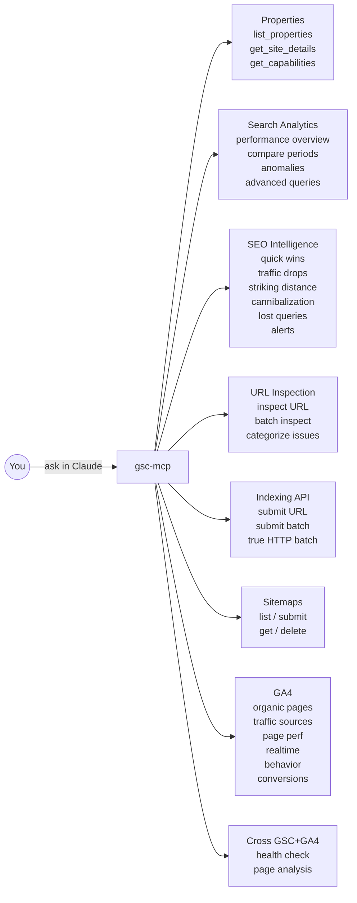

# gsc-mcp

[](https://pypi.org/project/gsc-mcp-tools/)
[](https://python.org)
[](https://github.com/FlorianBruniaux/google-search-console-mcp)
[](LICENSE)

Google Search Console MCP server with 36 tools covering search analytics, URL inspection, the Google Indexing API, Google Analytics 4, Core Web Vitals (CrUX), sitemap auditing, and JSON-LD schema validation. Built on Python 3.11+ and FastMCP.

**TL;DR:** Install with `uvx gsc-mcp-tools`, point at your GSC service account, and ask Claude things like "which pages on my site are crawled but not indexed? Submit them." The server handles the Google API calls, batching, retries, and quota tracking. All outputs are structured JSON so Claude can reason across results without parsing ambiguity.

## What you can do with it



### Tool summary

| Category | Tools | What it does |
|---|---|---|
| Properties | `list_properties`, `get_site_details`, `get_capabilities` | Discover and inspect your GSC properties |
| Analytics | `get_search_analytics`, `get_performance_overview`, `compare_search_periods`, `get_search_by_page_query`, `get_advanced_search_analytics`, `analytics_anomalies` | Query impressions, clicks, CTR, position; compare periods; detect anomalies |
| SEO | `quick_wins`, `traffic_drops`, `seo_striking_distance`, `seo_cannibalization`, `seo_lost_queries`, `check_alerts` | Surface opportunities, diagnose drops, detect cannibalization |
| Inspection | `inspect_url`, `batch_url_inspection`, `check_indexing_issues` | URL indexing status, crawl verdict, canonical, categorized by issue type |
| Indexing | `submit_url`, `submit_batch` | Request (re)indexing via the Google Indexing API, true HTTP batch, quota tracking |
| Sitemaps | `list_sitemaps`, `submit_sitemap`, `sitemaps_get`, `sitemaps_delete`, `sitemap_audit` | Manage submitted sitemaps; audit declared URLs against GSC coverage |
| GA4 | `ga4_organic_landing_pages`, `ga4_traffic_sources`, `ga4_page_performance`, `ga4_realtime`, `ga4_user_behavior`, `ga4_conversion_funnel` | Analytics 4 data: sessions, engagement, conversions, realtime (all filterable by `hostname` and `country`) |
| Cross | `traffic_health_check`, `page_analysis` | Join GSC clicks with GA4 sessions to catch tracking gaps and score pages by opportunity |
| CrUX | `crux_page_vitals`, `crux_history` | Real-user Core Web Vitals (LCP, INP, CLS, FCP, TTFB) from the Chrome UX Report API, requires `CRUX_API_KEY` |
| Technical | `schema_validate` | Fetch any public URL and validate its JSON-LD structured data schemas; suggests missing schemas by URL pattern |

## Why this exists

Two solid open-source projects cover parts of this problem:

**[AminForou/mcp-gsc](https://github.com/AminForou/mcp-gsc)** (Python, 1k+ stars) has excellent search analytics, rich SEO tooling, and solid OAuth + Service Account auth. It does not include the Google Indexing API at all (no `submit_url`, no `submit_batch`). You can analyze your traffic but you cannot request reindexing.

**[Suganthan-Mohanadasan/Suganthans-GSC-MCP](https://github.com/Suganthan-Mohanadasan/Suganthans-GSC-MCP)** (Node.js/TypeScript) adds the Indexing API, but its `submit_batch` is a sequential `for` loop with a 100ms delay between requests, not a real HTTP batch. It also mixes plain-text and JSON outputs, hardcodes version strings that diverge from package.json, and has no retry logic.

This project takes the auth patterns and SEO tools from the first, the Indexing API scope from the second, and fixes the gaps in both.

### Why Python instead of Go or Rust

The Google API Python client (`google-api-python-client`) is the official, best-maintained client for these APIs. It ships `service.new_batch_http_request()` natively, which is what makes true HTTP multipart batching possible without implementing the wire format by hand. The Go and Rust ecosystem for Google APIs relies on unofficial or auto-generated clients that do not expose this method. FastMCP also has first-class Python support with minimal boilerplate. The trade-off is startup latency (a few hundred ms vs near-zero for a compiled binary), but for a local MCP server called interactively by Claude that trade-off is irrelevant.

### What changed vs the two inspirations

| Feature | AminForou/mcp-gsc | Suganthan | gsc-mcp |
|---|---|---|---|
| Google Indexing API | No | Yes (fake batch) | Yes (true HTTP batch) |
| submit_batch | N/A | Sequential loop | `new_batch_http_request()`, 100/chunk |
| Token storage | pickle | pickle | JSON (`creds.to_json()`) |
| Retry on 429/5xx | No | No | Yes, exponential backoff |
| Quota tracking | No | No | Yes, warns at 180/200 |
| Output format | Mixed text+JSON | Mixed | 100% JSON + `_meta` block |

## Tools (32)

| Category | Tool | Description |
|---|---|---|
| Meta | `get_capabilities` | List all available tools |
| Properties | `list_properties` | List all GSC properties |
| Properties | `get_site_details` | Get details for a specific property |
| Analytics | `get_search_analytics` | Query search performance data |
| Analytics | `get_performance_overview` | Aggregate totals + top queries |
| Analytics | `compare_search_periods` | Compare two consecutive periods |
| Analytics | `get_search_by_page_query` | Performance broken down by page and query |
| Analytics | `get_advanced_search_analytics` | Flexible query with custom dimensions and filters |
| Analytics | `analytics_anomalies` | Z-score anomaly detection on daily clicks |
| SEO | `quick_wins` | Pages in positions 4-15 with CTR below benchmark |
| SEO | `traffic_drops` | Queries with declining clicks, with diagnosis |
| SEO | `check_alerts` | Traffic concentration risks and ranking opportunities |
| SEO | `seo_striking_distance` | Queries in positions 8-15, one push away from page 1 |
| SEO | `seo_cannibalization` | Queries split across multiple pages (HHI conflict score) |
| SEO | `seo_lost_queries` | Queries with a click drop >= 80% vs the previous period |
| Inspection | `inspect_url` | URL indexing status via URL Inspection API |
| Inspection | `batch_url_inspection` | Inspect up to 10 URLs at once |
| Inspection | `check_indexing_issues` | Inspect URLs and categorize by issue type |
| Indexing | `submit_url` | Request indexing for a single URL |
| Indexing | `submit_batch` | Request indexing for multiple URLs (true HTTP batch) |
| Sitemaps | `list_sitemaps` | List submitted sitemaps |
| Sitemaps | `submit_sitemap` | Submit a sitemap URL |
| Sitemaps | `sitemaps_get` | Fetch details for a single sitemap |
| Sitemaps | `sitemaps_delete` | Delete a submitted sitemap (with safety check) |
| GA4 | `ga4_organic_landing_pages` | Sessions and engagement for organic landing pages |
| GA4 | `ga4_traffic_sources` | Sessions and conversions by channel, source and medium |
| GA4 | `ga4_page_performance` | 7 metrics per page path, optional CONTAINS filter |
| GA4 | `ga4_realtime` | Active users right now by screen, country and device |
| GA4 | `ga4_user_behavior` | Device, country and user-type breakdowns in one batch call |
| GA4 | `ga4_conversion_funnel` | Converting pages and event counts, optional event filter |
| Cross | `traffic_health_check` | Ratio sessions GA4 / clics GSC pour détecter les tracking gaps |
| Cross | `page_analysis` | Jointure GSC+GA4 par page avec opportunity score, triée par priorité |

## Requirements

- Python 3.11+
- A Google Cloud project with the following APIs enabled: Google Search Console API, Web Search Indexing API, Google Analytics Data API
- A Service Account JSON key (recommended) or OAuth Desktop credentials
- For the Indexing API: the service account must have **Owner-level** access on the GSC property (Full access is not enough)
- Indexing API default quota: 200 requests per day

## Installation

```bash
uvx gsc-mcp-tools
```

Or with pip:

```bash
pip install gsc-mcp-tools
```

To run from source:

```bash
git clone https://github.com/FlorianBruniaux/google-search-console-mcp
cd google-search-console-mcp
python3 -m venv .venv && source .venv/bin/activate
pip install -e .
```

## Configuration

**Full setup guide:** [docs/google-setup.md](docs/google-setup.md) covers creating a Google Cloud project, enabling APIs, creating a service account, adding it to GSC with the right permission level, and configuring GA4.

**First audit prompts:** [docs/starter-prompt.md](docs/starter-prompt.md) contains ready-to-use prompts for a full site audit, a 5-minute health check, single-page inspection, reindexing workflow, and GA4-only analysis.

### Quick start (service account)

```bash
export GSC_SERVICE_ACCOUNT_PATH=/absolute/path/to/service-account.json
export GSC_SKIP_OAUTH=true
export GA4_PROPERTY_ID=123456789   # only needed for GA4 tools
export CRUX_API_KEY=AIza...        # only needed for crux_page_vitals, crux_history
gsc-mcp
```

`CRUX_API_KEY` is a Google API key (not a service account) with the **Chrome UX Report API** enabled in your GCP Console. It is separate from GSC auth and only required for CrUX tools.

### Claude Desktop

Add to `~/Library/Application Support/Claude/claude_desktop_config.json`:

```json
{
  "mcpServers": {
    "gsc-mcp": {
      "command": "uvx",
      "args": ["gsc-mcp-tools"],
      "env": {
        "GSC_SERVICE_ACCOUNT_PATH": "/absolute/path/to/service-account.json",
        "GSC_SKIP_OAUTH": "true",
        "GA4_PROPERTY_ID": "123456789",
        "CRUX_API_KEY": "AIza..."
      }
    }
  }
}
```

Remove `GA4_PROPERTY_ID` if you are not using GA4 tools. Restart Claude Desktop after saving.

### Multi-property support

To query a different GA4 property without changing the config, pass `property_id` directly to any GA4 or cross tool:

```python
ga4_traffic_sources(property_id="443684366")
traffic_health_check(site="sc-domain:example.com", property_id="443684366")
```

## Development

```bash
python3 -m venv .venv && source .venv/bin/activate
pip install -e ".[dev]"
pytest tests/ -v
```

222+ tests, all mocked (no real Google API calls needed).

## Inspirations

- [AminForou/mcp-gsc](https://github.com/AminForou/mcp-gsc): auth patterns, OAuth + Service Account flow, SEO analytics structure
- [Suganthan-Mohanadasan/Suganthans-GSC-MCP](https://github.com/Suganthan-Mohanadasan/Suganthans-GSC-MCP): Indexing API scope, `with_meta()` output pattern

## License

MIT
