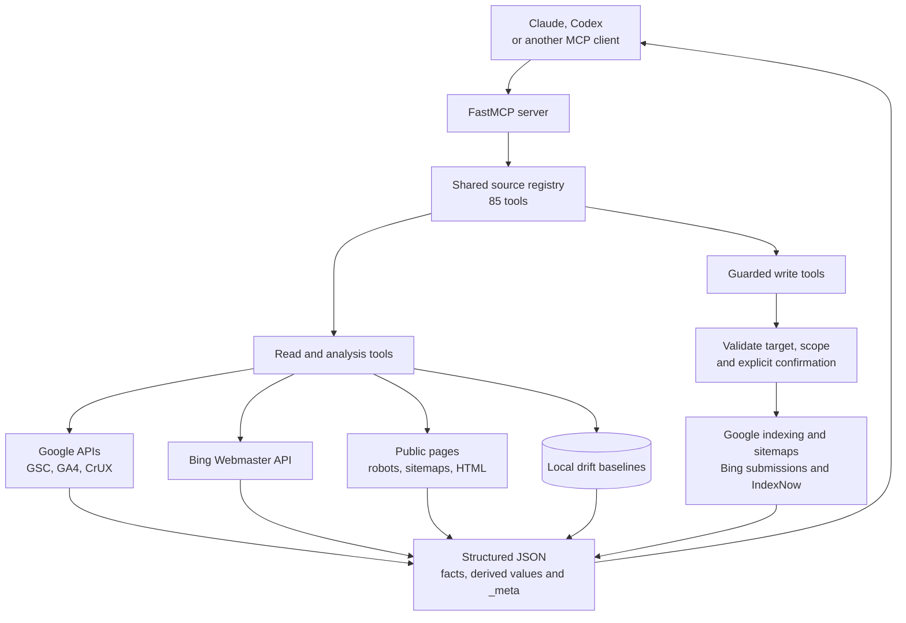

# Search Console MCP

<table>
  <tr>
    <td width="64">
      <a href="https://www.florian.bruniaux.com/about/?utm_source=github&amp;utm_medium=readme&amp;utm_campaign=google-search-console-mcp"></a>
    </td>
    <td>
      <strong><a href="https://www.florian.bruniaux.com/about/?utm_source=github&amp;utm_medium=readme&amp;utm_campaign=google-search-console-mcp">Florian BRUNIAUX</a></strong> &middot; AI Founding Engineer @ <a href="https://methode-aristote.fr/">Méthode Aristote</a><br />
      13 years from developer to CTO / VP Eng &middot; <a href="https://www.florian.bruniaux.com/blog/?utm_source=github&amp;utm_medium=readme&amp;utm_campaign=google-search-console-mcp">Blog &#8599;</a> &middot; <a href="https://www.florian.bruniaux.com/projects/?utm_source=github&amp;utm_medium=readme&amp;utm_campaign=google-search-console-mcp">Projects &#8599;</a>
    </td>
  </tr>
</table>

[](https://pypi.org/project/gsc-mcp-tools/)
[](https://python.org)
[](#tools-85)
[](#search-engine-coverage)
[](https://github.com/FlorianBruniaux/google-search-console-mcp)
[](https://github.com/FlorianBruniaux/google-search-console-mcp/actions/workflows/publish.yml)
[](LICENSE)

**Know what to fix to improve your search rankings, without becoming an SEO expert.**

Ask Claude or Codex to analyze your site's latest SEO changes and suggest what to fix first. Search Console MCP gives your assistant the search metrics and page audits it needs to explain traffic drops, find ranking opportunities, and turn the findings into a prioritized action plan.

Search Console MCP is the open-source connection between your data and your AI assistant. The server retrieves metrics and runs analyses; Claude, Codex or another MCP client explains the findings and proposes corrections. A coding assistant with access to your repository can also help implement the fixes you choose.

<p align="center">
  
</p>

<p align="center">
  <a href="https://search-console.bruniaux.com/">Website</a> &middot;
  <a href="https://search-console.bruniaux.com/docs/">Documentation</a> &middot;
  <a href="https://search-console.bruniaux.com/fr/docs/">Documentation FR</a> &middot;
  <a href="#what-you-get">What you get</a> &middot;
  <a href="#choose-your-starting-point">Use cases</a> &middot;
  <a href="#quick-start">Quick start</a> &middot;
  <a href="#tools-85">Tools</a> &middot;
  <a href="#evidence-and-safety">Data limits &amp; safety</a>
</p>

## What you get

> Analyze my site's latest SEO changes. Explain what improved or declined, find opportunities to rank higher, and suggest the fixes I should make first.

Your AI assistant uses the connected tools to produce:

- **A diagnosis of recent changes:** which pages and queries gained or lost clicks, impressions or positions, with evidence and possible explanations.
- **A prioritized list of opportunities:** pages close to page one, search results getting impressions but few clicks, and competing pages targeting the same query.
- **Concrete suggested fixes:** title and description changes, content briefs, internal-link improvements, and technical or indexing issues to investigate.
- **A follow-up comparison:** rerun the analysis after making changes to see how clicks, impressions and positions evolved.

For example, if a page gets impressions but few clicks, the assistant can inspect its title and description and suggest a rewrite. If a page is close to page one, it can check its content and internal links before recommending changes. These are example workflows, not measured results for your site.

Initial account setup and review of suggested changes are still required. Recurring checks need a scheduler or automation in your client; the server does not run them on its own. Ranking improvements must be measured after the changes and are not guaranteed.

### A real audit

See a [real analysis of my Claude Code Ultimate Guide site](examples/cc-guide-live-audit.md), run on 2026-10-07 with 14 live MCP calls. It measured 459 clicks and 55,921 impressions over 28 days, investigated three pages and proposed actions tied to the observed data. The [request/response trace](examples/evidence/2026-10-07-cc-guide.json) shows the parameters, timestamps and selected results. These are analysis findings; no site correction or ranking gain has been measured from this run.

## What it covers

| Need | Main capabilities |
| --- | --- |
| Search performance | Queries, pages, dates, search types, anomalies, quick wins and traffic drops |
| Google and Bing comparison | Side-by-side query or page metrics without merging incompatible position semantics |
| Site health | GSC, GA4, CrUX, schema and public-page signals with graceful degradation |
| Technical and content SEO | Metadata, headings, hreflang, internal links, structured data, preload and content quality |
| Indexing and feeds | Google indexing requests, sitemaps, IndexNow and guarded Bing URL or feed submissions |
| Automation | MCP tools, `gsc-cli`, Claude agents, reusable skills and machine-readable architecture docs |

## Choose your starting point

New to SEO? Start with a site assessment: understand what to analyze and why, get three first actions, and learn which metrics to follow. You can begin with public pages, then connect Google Search Console for search performance data. GA4 and Bing are optional.

Choose a workflow to get a prompt to copy, the data it needs and an illustrative result:

- [Start with SEO](https://search-console.bruniaux.com/#seo-getting-started): assess your site, get three priorities and a measurement plan, with explanations in plain language.
- [Understand a traffic drop](https://search-console.bruniaux.com/#seo-traffic): compare periods with Google Search Console; optional GA4 adds visitor behavior.
- [Find ranking opportunities](https://search-console.bruniaux.com/#seo-rankings): use configured Google or Bing search metrics and inspect the relevant pages.
- [Check page visibility](https://search-console.bruniaux.com/#seo-indexing): audit public pages and use Google Search Console for indexing status; Bing can add crawl signals.

Replace the example site in the prompt with your own. Every copied prompt explicitly asks the assistant to use Search Console MCP, verify its tools and guide installation or Google setup if needed. It includes the [installation guide](docs/installation.md), [Google setup guide](docs/google-setup.md) and the matching GitHub example. The prompts request analysis and recommendations without applying site changes.

## Quick start

### Start here

| Goal | Command or guide | Result |
| --- | --- | --- |
| Run the published package | `uvx gsc-mcp-tools` | Starts all 85 Google, Bing, GA4, CrUX, IndexNow and technical SEO tools over stdio |
| Install for Codex or Claude Desktop | [Installation guide](https://search-console.bruniaux.com/docs/installation/) | Persistent executable, upgrades, client configuration and verification |
| Develop from the source checkout | [Install from source](#source-checkout-for-development) | Editable install for unreleased changes and local development |
| Configure Google access | [Google setup guide](https://search-console.bruniaux.com/docs/google-setup/) | Service Account or OAuth access to the selected properties |
| Configure Bing access | [Bing setup guide](https://search-console.bruniaux.com/docs/bing-setup/) | One account-level key for the verified sites visible to that account |
| Run a first audit | [Starter prompts](https://search-console.bruniaux.com/docs/prompts/) | Full audit, health check, page inspection or GA4 analysis prompt |
| Use the shell instead of MCP | [CLI usage](#cli-usage) | Commands generated from the source registry |

### Requirements

- Python 3.11+
- For Google tools: a Google Cloud project with the Search Console API, Web Search Indexing API and Google Analytics Data API enabled, plus a Service Account JSON key or OAuth Desktop credentials
- For Bing tools: a Bing Webmaster Tools account, at least one verified site and a Bing Webmaster API key

### Published package

Use the published package for the complete 85-tool registry, including Bing:

```bash
uvx gsc-mcp-tools
```

For a persistent MCP client, install the latest stable package once and configure the absolute executable path. This avoids keeping an extra `uvx` launcher process beside every running server:

```bash
uv tool install gsc-mcp-tools
command -v gsc-mcp-tools
gsc-cli list
```

Upgrade that installation when a new release is available:

```bash
uv tool upgrade gsc-mcp-tools
```

To reproduce this release exactly, use `uv tool install --force gsc-mcp-tools==1.3.1`. A version-pinned installation remains pinned; install a newer explicit version or reinstall without `==...` before using `uv tool upgrade`.

Release `1.2.0` was built and published by [GitHub Actions](https://github.com/FlorianBruniaux/google-search-console-mcp/actions/workflows/publish.yml) through [PyPI Trusted Publishing](https://docs.pypi.org/trusted-publishers/). The workflow checks that the tag matches `pyproject.toml`, runs the full test suite, validates and smoke-tests the built wheel, then publishes that same artifact with a short-lived OIDC credential. See the [GitHub release](https://github.com/FlorianBruniaux/google-search-console-mcp/releases/tag/v1.2.0) and [PyPI files](https://pypi.org/project/gsc-mcp-tools/1.2.0/#files).

<details>
<summary>Install with pip instead of uvx</summary>

```bash
pip install gsc-mcp-tools
```

</details>

### Configure the providers you use

**Installation guide:** [docs/installation.md](docs/installation.md) covers persistent and one-time installs, upgrades, Codex project scoping, Claude Desktop, provider variants and verification.

**Provider setup:** [docs/google-setup.md](docs/google-setup.md) covers Google credentials and GA4. [docs/bing-setup.md](docs/bing-setup.md) covers the Bing Webmaster API key, verified sites and the separate IndexNow key.

**First audit prompts:** [docs/starter-prompt.md](docs/starter-prompt.md) contains ready-to-use prompts for Google, Bing, cross-engine comparison, single-page inspection, eligible Indexing API submissions and GA4 analysis.

Use only the variables required by the provider families you enable:

```bash
export GSC_SERVICE_ACCOUNT_PATH=/absolute/path/to/service-account.json
export GSC_SKIP_OAUTH=true
export GA4_PROPERTY_ID=123456789   # only needed for GA4 tools
# Load CRUX_API_KEY from your secret store for CrUX tools.
# Load BING_WEBMASTER_API_KEY from your secret store for Bing tools.
gsc-mcp
```

`CRUX_API_KEY` is a Google API key (not a service account) with the **Chrome UX Report API** enabled in your GCP Console. It is separate from GSC auth and only required for CrUX tools.

<details>
<summary>Claude Desktop configuration</summary>

### Claude Desktop

Install the latest stable package once with `uv tool install gsc-mcp-tools`, then copy the absolute path returned by `command -v gsc-mcp-tools` into the configuration:

Add to `~/Library/Application Support/Claude/claude_desktop_config.json`:

```json
{
  "mcpServers": {
    "gsc-mcp": {
      "command": "/absolute/path/to/gsc-mcp-tools",
      "env": {
        "GSC_SERVICE_ACCOUNT_PATH": "/absolute/path/to/service-account.json",
        "GSC_SKIP_OAUTH": "true"
      }
    }
  }
}
```

Remove credentials for tool families you do not use, then restart Claude Desktop. Saving the file does not restart the MCP process.

For local development, set `command` to the checkout's absolute executable path, for example `/absolute/path/to/google-search-console-mcp/.venv/bin/gsc-mcp`. The source checkout and version 1.3.1 expose the same 85-tool catalogue.

</details>

<details>
<summary>Codex configuration without process proliferation</summary>

### Codex

Codex starts a dedicated stdio MCP server for each task that loads it. A declaration in the user-level `~/.codex/config.toml` therefore applies to every project and can leave many legitimate server processes alive while tasks remain active. Running through `uvx` adds a launcher process to each server.

Install the package once:

```bash
uv tool install gsc-mcp-tools
command -v gsc-mcp-tools
```

Then add the server only to trusted projects that need search data by creating `.codex/config.toml` in the project root:

```toml
[mcp_servers.gsc-mcp]
command = "/absolute/path/to/gsc-mcp-tools"
startup_timeout_sec = 60

[mcp_servers.gsc-mcp.env]
GSC_SERVICE_ACCOUNT_PATH = "/absolute/path/to/service-account.json"
GSC_SKIP_OAUTH = "true"
```

Keep this file untracked when it contains credentials. Remove provider variables you do not use. Codex loads project `.codex/config.toml` only for trusted projects; project configuration and precedence are documented in the [official Codex configuration guide](https://developers.openai.com/codex/config-basic).

Do not add a global single-instance lock to a stdio server. Each client owns a separate stdin/stdout channel, so blocking later instances would break concurrent tasks instead of sharing one server safely. A shared deployment would require the streamable HTTP transport and its own authentication boundary.

</details>

### Select MCP tool families (since 1.3.1)

Since version 1.3.1, set `GSC_MCP_TOOL_FAMILIES=analytics,seo,sitemaps,links` in the MCP server environment to expose these families plus `core`. The default exposes all 85 tools. Restart the server or client after changing the selection; `gsc-cli list` keeps the full catalogue. Selection does not grant provider access or write permission. See the [tool-family configuration](docs/installation.md#select-mcp-tool-families-since-131) for all family names and startup validation. Version 1.3.0 predates this setting.

### Bing Webmaster API key

1. Sign in to [Bing Webmaster Tools](https://www.bing.com/webmasters/) and verify every site you want the account to access.
2. Open the API access settings and generate an API key.
3. Store the key in your secret manager or local environment as `BING_WEBMASTER_API_KEY`. Never pass it as a tool argument or commit it to a file.
4. Call each Bing tool with its `site` argument, for example `https://example.com/`. One user-level key can access every verified site visible to that account.

The Bing Webmaster API key and the IndexNow key have different scopes:

- Bing Webmaster API reads private account data and manages verified sites. The server reads its user-level key from `BING_WEBMASTER_API_KEY`.
- IndexNow notifies participating engines about changed URLs. Its key must be verifiable on each target host or subdomain, and `indexnow_submit` currently receives that key as an explicit argument.
- The Bing Webmaster Tools web interface exposes features that the public API does not. Full URL Inspection and AI Performance are not available through the public API used here.

Do not reuse the Bing Webmaster API key as an IndexNow key.

<details>
<summary>Use multiple GA4 properties</summary>

### Multi-property support

To query a different GA4 property without changing the config, pass `property_id` directly to any GA4 or cross tool:

```python
ga4_traffic_sources(property_id="987654321")
traffic_health_check(site="sc-domain:example.com", property_id="987654321")
```

</details>

## Troubleshooting

<details>
<summary>Troubleshooting common setup and API errors</summary>

**`uvx gsc-mcp-tools` launches but no tools appear in Claude Desktop**

Fully quit Claude Desktop (`Cmd+Q`) and reopen it. Saving the config file is not enough; the MCP process is only started on launch.

**Codex keeps many `gsc-mcp-tools` processes alive**

Check whether `gsc-mcp` is declared in user-level `~/.codex/config.toml`. Move it to project-level `.codex/config.toml` when it is not needed in every task, and configure the executable installed by `uv tool install` instead of `uvx`. Restart Codex after changing the configuration; already-running tasks keep the server configuration they loaded at startup.

**`GSC_SERVICE_ACCOUNT_PATH` is set but auth fails**

Use an absolute path. Relative paths and `~/` tilde expansion are not resolved. Check with `echo $GSC_SERVICE_ACCOUNT_PATH` that the value is a full `/Users/...` path.

**GA4 tools return "property_id required"**

Either set `GA4_PROPERTY_ID` in your config env block, or pass `property_id` directly to the tool call. The env var is the default; the parameter overrides it per call.

**`crux_page_vitals` or `crux_history` returns "CRUX_API_KEY not set"**

CrUX tools require a separate Google API key (not the service account) with the **Chrome UX Report API** enabled. Create one in Google Cloud Console under Credentials, enable the API, then inject the key from your secret store into the server environment as `CRUX_API_KEY`.

**Indexing API returns 403 on `submit_url`**

The service account needs **Owner-level** access on the GSC property, not just Full access. Go to Search Console Settings > Users and permissions, find the service account email, and upgrade its role to Owner.

**`submit_batch` quota warning at 180/200**

The Indexing API default quota is 200 requests per day per GCP project. The tool warns at 180. To increase it, request a quota increase in Google Cloud Console under APIs & Services > Quotas.

</details>

## The data behind the recommendations

Google Search Console and Bing Webmaster Tools show how people find your pages in search. Optional GA4 data adds what those visitors do on your site; CrUX and public-page audits help identify performance, content and technical issues. Your assistant can use these sources together to decide which pages need attention.

Version 1.3.1 exposes 85 FastMCP tools. The server handles authentication, API calls, validation, retries and structured JSON output. [Use a starter prompt](https://search-console.bruniaux.com/docs/prompts/) to run your first analysis.

> [!IMPORTANT]
> `gsc-mcp-tools==1.2.0` is the first published version with Bing support. It includes 19 Bing tools, cross-engine comparison and Bing support in three SEO analyses.

> [!NOTE]
> An API submission reported as accepted proves neither crawl nor indexation. Search Console MCP keeps observed facts, derived metrics and recommendations separate.

### Why private search data needs MCP

Public web search cannot answer questions tied to private Search Console, Bing Webmaster Tools or GA4 properties. Search Console MCP lets an assistant analyse those measured values while preserving provider boundaries and uncertainty.

<details>
<summary>Read the concrete example and API rationale</summary>

GSC data is private. No web search agent can read it.

Given "which of my pages are wasting impressions with zero clicks?", an AI without API access has two honest options: admit it cannot answer, or guess from publicly visible signals. Neither is a diagnosis.

With this server, Claude pulls the actual numbers: `/projects/` at position 10.1 with 87 impressions and 0 clicks, CTR benchmark 2.3% at that rank. That is the concrete gap between "you should optimize your meta titles" (available from any AI with internet access) and "your /projects/ page has 87 impressions and 0 clicks, rewrite the title" (requires your numbers).

Some tasks work without private data: checking indexation with `site:`, parsing sitemap structure, reading robots.txt. For those, any web-capable agent gets you there. But for anything that requires private GSC metrics (traffic drops, striking-distance queries, CTR anomalies, Indexing API submissions), there is no substitute for API access.

The server also handles Google and Bing API mechanics: isolated credentials, bounded retries, same-origin checks for Bing writes, true HTTP batch for Google indexing requests, and structured JSON output across the source registry. The two providers keep distinct position semantics and expose uncertainty instead of forcing incomparable data into one claim.

</details>

## How it works


```mermaid
flowchart TD
    C[Claude, Codex<br/>or another MCP client] --> S[FastMCP server]
    S --> R[Shared source registry<br/>85 tools]
    R --> A[Read and analysis tools]
    R --> W[Guarded write tools]
    A --> G[Google APIs<br/>GSC, GA4, CrUX]
    A --> B[Bing Webmaster API]
    A --> P[Public pages<br/>robots, sitemaps, HTML]
    A --> L[(Local drift baselines)]
    W --> V[Validate target, scope<br/>and explicit confirmation]
    V --> M[Google indexing and sitemaps<br/>Bing submissions and IndexNow]
    G --> O[Structured JSON<br/>facts, derived values and _meta]
    B --> O
    P --> O
    L --> O
    M --> O
    O --> C
```

Google and Bing share clicks, impressions and derived CTR where those fields exist. Provider-specific values remain separate, and cross-engine deltas appear only when both observed windows are exact and equal.

## Evidence and safety

> [!NOTE]
> **Unavailable metrics are reported as unavailable.** Unsupported Bing analyses return an explicit limitation, and Google and Bing positions stay separate. Cross-engine click and impression deltas are omitted unless both observed windows are exact and equal. [Compare Google and Bing coverage](#search-engine-coverage).

Every tool returns structured JSON. The `_meta` block records diagnostics such as the provider and observed window where the tool can establish them. Search Console MCP does not turn an unavailable field into a negative result or merge Google and Bing ranking semantics into one number.

GA4 reports identify the effective property in `_meta.sources.ga4.property`, including when `GA4_PROPERTY_ID` supplies the default. Combined reports also retain the requested GSC property in `_meta.sources.gsc.site`. `_meta.params` preserves the original inputs, so an omitted `property_id` can remain `null` there while the resolved source is known. Missing child provenance remains `null`; the server does not infer a GA4-to-GSC site mapping. See the [source identity contract](https://search-console.bruniaux.com/docs/evidence-and-safety/#source-identities).

Remote writes require the agent to identify the exact target and volume, read current state where available, and obtain explicit confirmation before calling the tool. The returned API status is reported without extrapolating crawl, indexation or ranking effects.

### Search engine coverage

<details>
<summary>Compare Google and Bing analysis support</summary>

| Analysis | Google | Bing |
|---|---|---|
| Raw query, page and date metrics | Supported | Supported within Bing's observed window |
| `quick_wins` | Supported | Supported with `engine="bing"` when position is present |
| `seo_striking_distance` | Supported | Supported with `engine="bing"` when position is present |
| `prune_candidates` | Supported | Supported with `engine="bing"`; indexation must be checked separately |
| `traffic_drops`, `seo_lost_queries` | Supported | Explicit refusal: exact period comparison unavailable |
| `check_alerts`, `seo_cannibalization` | Supported | Explicit refusal: bulk page-query dimension unavailable |
| Cross-engine query or page comparison | Supported through `compare_search_engines` | Deltas are omitted unless both observed windows are exact and equal |

Bing keyword-research endpoints are not exposed. `GetKeywordStats` and `GetRelatedKeywords` returned HTTP 400 in the redacted live canary, so their contract remains `UNKNOWN`.

</details>

<details>
<summary>Submission workflow, confirmation rules and current Bing limits</summary>

### Submission workflow and confirmation

There are nine tools that mutate remote state: five existing tools (`submit_url`, `submit_batch`, `submit_sitemap`, `sitemaps_delete`, `indexnow_submit`) and four Bing tools (`bing_url_submit`, `bing_urls_submit_batch`, `bing_feed_submit`, `bing_feed_remove`). Before any call, the agent must read the current state, name the exact target and volume, obtain explicit confirmation, call the tool once, then report its returned status without extrapolation.

Use this sequence for search changes:

1. Analyse measured data and state its observed window.
2. Recommend a change, separating measured facts, derived metrics and recommendations.
3. Correct the page or feed outside this MCP server.
4. Submit only after explicit confirmation and same-origin validation.
5. Verify the returned API status. An accepted request proves neither crawl nor indexation.
6. Measure a later comparable window before attributing an effect.

Current Bing runtime limits are explicit: data freshness is unknown; quota integers are not known to represent totals or remaining capacity; non-empty crawl issues, nested backlink rows and `RemoveFeed` remain unverified against live production data. No Bing write was executed against a production site during validation. Batch URL submission is therefore refused before mutation. `bing_url_info` can report a last crawl date, but it cannot provide a complete public URL Inspection verdict.

</details>

## Tools (85)

Release `gsc-mcp-tools==1.3.0` includes `ga4_ai_referrals`, `editorial_audit`, `search_change_breakdown` and `link_targets_audit`, field-level evidence methods, content-trust observations and comparison/challenge fixes. Version 1.3.1 retains 85 tools and adds optional MCP discovery selection, CLI JSON string lists, and the SEO/Bing feedback fixes described in the [changelog](CHANGELOG.md#131---2026-10-08). See the [evidence and safety guide](https://search-console.bruniaux.com/docs/evidence-and-safety/) for availability, source matching and method limits.

<details>
<summary>Show all 85 source tools</summary>

| Category | Tool | Description |
|---|---|---|
| Meta | `get_capabilities` | List all available tools |
| Properties | `list_properties` | List all GSC properties |
| Properties | `get_site_details` | Get details for a specific property |
| Analytics | `get_search_analytics` | Query search performance data |
| Analytics | `get_performance_overview` | Aggregate totals + top queries |
| Analytics | `search_change_breakdown` | Compare explicit equal Google windows with independent bounded page/query/country/device views, coverage and residuals |
| Analytics | `compare_search_periods` | Compare two consecutive periods |
| Analytics | `get_search_by_page_query` | Performance broken down by page and query |
| Analytics | `get_advanced_search_analytics` | Flexible query with custom dimensions and filters |
| Analytics | `analytics_anomalies` | Z-score anomaly detection on daily clicks |
| Analytics | `discover_performance` | Top pages by impressions in Google Discover |
| Analytics | `news_performance` | Top pages by impressions in Google News |
| Analytics | `search_type_breakdown` | Clicks and impressions split across web, Discover, News, image, video |
| Analytics | `ai_overviews_impact` | Queries with searchAppearance data, graceful 400/403 fallback |
| SEO | `quick_wins` | Pages in positions 4-15 with CTR below benchmark |
| SEO | `traffic_drops` | Declining clicks with metric-based candidate diagnoses, not causal proof |
| SEO | `check_alerts` | Traffic concentration risks and ranking opportunities |
| SEO | `seo_striking_distance` | Queries in positions 8-15, one push away from page 1 |
| SEO | `seo_cannibalization` | Queries split across pages (HHI score); search operators excluded by default since 1.3.1 |
| SEO | `seo_lost_queries` | Queries with a click drop >= 80% vs the previous period |
| Inspection | `inspect_url` | URL indexing status via URL Inspection API |
| Inspection | `batch_url_inspection` | Inspect up to 10 URLs at once |
| Inspection | `check_indexing_issues` | Inspect URLs and categorize by issue type |
| Indexing | `submit_url` | Request indexing for a single URL |
| Indexing | `submit_batch` | Request indexing for multiple URLs (true HTTP batch) |
| Sitemaps | `list_sitemaps` | List submitted sitemaps |
| Sitemaps | `submit_sitemap` | Submit a sitemap URL |
| Sitemaps | `sitemaps_get` | Fetch details for a single sitemap |
| Sitemaps | `sitemaps_delete` | Delete a submitted sitemap (with safety check) |
| Sitemaps | `sitemap_audit` | Fetch a sitemap and compare its URLs with 90 days of Search Analytics page rows; does not measure indexation |
| GA4 | `ga4_organic_landing_pages` | Sessions and engagement for organic landing pages |
| GA4 | `ga4_traffic_sources` | Sessions and conversions by channel, source and medium |
| GA4 | `ga4_ai_referrals` | Recorded assistant-attributed visits, exact source rules and coverage-gated shares |
| GA4 | `ga4_page_performance` | 7 metrics per page path, optional CONTAINS filter |
| GA4 | `ga4_realtime` | Active users right now by screen, country and device |
| GA4 | `ga4_user_behavior` | Device, country and user-type breakdowns in one batch call |
| GA4 | `ga4_conversion_funnel` | Converting pages and event counts, optional event filter |
| GA4 | `ga4_funnel` | Multi-step funnel report via GA4 v1alpha RunFunnelReport, conversion rate per step |
| Cross | `traffic_health_check` | Equal requested dates, zero/empty/unavailable states and coverage-gated heuristic ratios |
| Cross | `page_analysis` | GSC+GA4 join per page with opportunity score, sorted by priority |
| Cross | `page_health_score` | Composite 0-100 score (GSC 30 pts, GA4 25 pts, CrUX 25 pts, schema 20 pts), graceful degradation per component |
| Cross | `content_brief` | Per-page top queries, question queries, and GA4 session data for content planning |
| CrUX | `crux_page_vitals` | Real-user Core Web Vitals (LCP, INP, CLS, FCP, TTFB) for a URL from the Chrome UX Report API |
| CrUX | `crux_history` | Historical Core Web Vitals trend (weekly data points) for a URL |
| Technical | `schema_validate` | Fetch any public URL and validate its JSON-LD schemas; suggests missing schemas by URL pattern |
| Technical | `schema_generate` | Generate a Schema.org JSON-LD block for Reservation, OrderAction, DiscussionForumPosting, or ProfilePage |
| Drift | `drift_baseline` | Capture a baseline snapshot of a page (title, H1-H3, schema, canonical, CWV) stored locally in SQLite |
| Drift | `drift_compare` | Diff a live fetch against the stored baseline and apply 17 rules (8 CRITICAL, 6 WARNING, 3 INFO) |
| Drift | `drift_history` | List previous comparison runs for a URL with triggered findings per run |
| Editorial | `editorial_audit` | FR/EN house-style warnings, localized excerpts and faithful rewrite guidance; no AI-authorship score |
| Content | `content_quality` | Fetch a URL and score visible text against E-E-A-T heuristics: filler phrases, information density, repetition, thin content |
| Content | `hreflang_audit` | Fetch a URL and validate its hreflang implementation: x-default, ISO 639-1 codes, region codes, self-ref, protocol consistency |
| Content | `page_technical_audit` | Fetch a URL and audit meta tags (title, description, canonical, robots), viewport, HTML lang, security headers, robots.txt Googlebot access |
| Content | `preload_audit` | Audit Speculation Rules, bfcache eligibility, and LCP preload signals: inline speculationrules blocks, Speculation-Rules header, link preload tags, deprecated prerender, cache-control blockers |
| CrUX | `crux_lcp_subparts` | Decompose LCP into four subparts (TTFB, resource load delay, duration, render delay) with dominant phase identification for targeted CWV remediation |
| Indexing | `indexnow_submit` | Submit URLs to IndexNow (Bing, Yandex, Seznam, Naver) via one POST; SSRF-safe URL validation, skipped-invalid count, ok/partial/error verdict |
| SEO | `parasite_risk` | Scan URL paths for parasite SEO patterns matching Google's 2024-11-19 site-reputation policy: sponsored/affiliate sections, Forbes Advisor, CNN Underscored patterns, affiliate query params |
| Technical | `ai_visibility_audit` | Check robots.txt and llms.txt; version 1.3.1 checks 10 agents, including ClaudeBot, Claude-User and Claude-SearchBot |
| Technical | `gbp_deprecation_lint` | Scan a page for deprecated Google Business Profile features: .business.site links, Reserve with Google, GBP appointment widgets |
| Technical | `pagespeed_audit` | Run a PageSpeed Insights API v5 audit: Lighthouse performance score, Core Web Vitals, top 3 improvement opportunities (requires GOOGLE_API_KEY) |
| Content | `heading_audit` | Audit heading structure: H1 uniqueness, level jumps (H2 to H4), title vs H1 word-for-word duplication, headings carrying no information, words per H2 |
| Links | `link_targets_audit` | Observe bounded internal destination HTTP statuses and redirect hops while preserving source anchors; no recursive crawl |
| Links | `internal_links_audit` | Audit a page's internal links weighted by zone (body, nav, footer, header, aside): targets linked only from footer/nav, generic and empty anchors, internal nofollow, self-links |
| Links | `link_equity_map` | Crawl the top pages by impressions, build the internal link graph, cross it with GSC: pages at position 11-20 with no body inbound link, orphan candidates, footer-only targets, hubs |
| SEO | `prune_candidates` | Classify pages by measured traffic (has_traffic, impressions_no_clicks, low_impressions, zero_impressions) before any pruning call; a page with clicks is never a candidate |
| Bing read | `bing_sites_list` | List sites visible to the Bing account and their observed verified state |
| Bing read | `bing_query_stats` | Query performance in Bing's observed rolling window |
| Bing read | `bing_page_stats` | Page performance in Bing's observed rolling window |
| Bing read | `bing_page_query_stats` | Query performance for one page |
| Bing read | `bing_rank_traffic_stats` | Daily clicks and impressions; no rank field is inferred |
| Bing read | `bing_crawl_stats` | Dated crawl counters in the requested local window |
| Bing read | `bing_crawl_issues` | Crawl issue flags; non-empty live item shape remains unverified |
| Bing read | `bing_crawl_settings_get` | Observed crawl-rate setting from the partial contract |
| Bing read | `bing_url_info` | Observed URL fields and last crawl date, without an indexation verdict |
| Bing read | `bing_url_traffic` | URL clicks, impressions and derived CTR |
| Bing read | `bing_feeds_list` | List registered Bing feeds |
| Bing read | `bing_feed_details` | Return every observed feed-detail row |
| Bing read | `bing_url_submission_quota` | Return quota integers with total-versus-remaining semantics marked unknown |
| Bing read | `bing_link_counts` | Backlink count page; nested runtime shape remains unverified |
| Bing read | `bing_url_links` | Backlinks for one URL; nested runtime shape remains unverified |
| Bing write | `bing_url_submit` | Submit one same-origin URL; acceptance does not prove indexation |
| Bing write | `bing_urls_submit_batch` | Validate a batch, then refuse it while quota semantics remain unknown |
| Bing write | `bing_feed_submit` | Submit one same-origin feed without claiming crawl or indexation |
| Bing write | `bing_feed_remove` | Remove a registered same-origin feed after explicit `confirm=true`; runtime contract unverified |
| Cross-engine | `compare_search_engines` | Compare query or page metrics; deltas require equal exact observed windows and positions stay side by side |

</details>

## CLI usage

After installation, `gsc-cli` is available as a standalone shell command. It derives its commands from the same registry as the MCP server. Version 1.3.1 and this checkout expose 85 commands, including ga4_ai_referrals, editorial_audit, search_change_breakdown and link_targets_audit. MCP family selection does not restrict CLI commands.

```bash
# List the commands in the installed build
gsc-cli list

# Run Google or Bing tools with flags
gsc-cli get-search-analytics --site https://example.com/ --days 28
gsc-cli bing-query-stats --site https://example.com/ --days 28 --limit 100
```

### Bing from the CLI

```bash
# Load BING_WEBMASTER_API_KEY from your local secret store before this command.
gsc-cli bing-sites-list
gsc-cli bing-query-stats --site https://example.com/ --days 28 --limit 100
gsc-cli compare-search-engines \
  --google-site sc-domain:example.com \
  --bing-site https://example.com/ \
  --days 28 \
  --dimension query
```

`BING_WEBMASTER_API_KEY` is process configuration. It never appears in the CLI flags, tool parameters, result metadata or sanitized Bing errors.

<details>
<summary>Advanced CLI arguments, authentication, metadata and exit codes</summary>

```bash
# Run another registered tool
gsc-cli get-performance-overview --site https://example.com/

# Multi-value flags for list parameters
gsc-cli batch-url-inspection \
  --urls https://example.com/page-1/ \
  --urls https://example.com/page-2/ \
  --site https://example.com/

# GA4 funnel with a JSON steps array
gsc-cli ga4-funnel \
  --steps '[{"name":"Visit","event":"page_view"},{"name":"Convert","event":"purchase"}]' \
  --start-date 28daysAgo \
  --end-date today

# Keep the _meta diagnostic block in output
gsc-cli list-properties --meta

# Pipe to jq
gsc-cli get-search-analytics --site https://example.com/ | jq '.rows[:5]'
```

String-list flags also accept a JSON array of strings:

```bash
gsc-cli batch-url-inspection --site https://example.com/ \
  --urls '["https://example.com/page-1/","https://example.com/page-2/"]'
```

Repeat the flag or use a JSON array; commas are literal URL characters, not separators. For example, `--urls 'https://example.com/a,b?q=x,y'` supplies one URL. Malformed arrays and non-string entries are rejected before a provider call. JSON string-list support is available since 1.3.1; repeated flags also work in release 1.3.0.

Set `GSC_SERVICE_ACCOUNT_PATH` for non-interactive use (same as the MCP server). To cache OAuth credentials interactively, run:

```bash
gsc-cli auth login --allow-browser
```

Exit codes: `0` success, `1` Google API error, `2` credential/config error or invalid arguments.

> **Quota note**: `submit-batch` and `submit-url` use the Google Indexing API (200 req/day limit). Each `gsc-cli` call starts a fresh process, so cross-invocation quota tracking is not implemented. The `@with_retry` decorator still catches 429s, but the in-process counter resets every call.

</details>

## Claude agents and skills

The `.claude/` directory ships 12 Claude Code agents, 14 skills and 2 development commands. The nine SEO workflow agents below each reference a focused skill. Three additional specialist agents cover Python implementation, pytest and security review.

### Agents

<details>
<summary>Show 9 GSC agents</summary>

| Agent | Skill | When to use |
|---|---|---|
| `gsc-seo-reporter` | `seo-weekly-report` | Weekly traffic recap, period-over-period summary |
| `gsc-traffic-doctor` | `traffic-drop-diagnosis` | Sudden or sustained drop in clicks or impressions |
| `gsc-content-optimizer` | `content-opportunities` | Pages close to page 1 (positions 4-20) worth a push |
| `gsc-cannibalization-checker` | `cannibalization-check` | Multiple pages competing for the same query |
| `gsc-indexing-auditor` | `indexing-audit` | Crawl errors, pages not indexed, coverage gaps |
| `gsc-sitemap-auditor` | `sitemap-audit` | Sitemap health and declared-vs-indexed coverage |
| `gsc-schema-auditor` | `schema-audit` | JSON-LD errors blocking rich results |
| `gsc-page-analyst` | `page-deep-dive` | Full diagnostic for a single URL |
| `gsc-ai-overviews-analyst` | `ai-overviews-impact` | Available query and searchAppearance rows for AI Overview analysis |

</details>

To use an agent from Claude Code, ask naturally ("why did traffic drop?") or invoke it by name. Each agent loads its skill at runtime and returns a structured answer, not a narration of what it did.

### Skills

Skills live in `.claude/skills/` and are invokable directly via slash command. They define the exact steps, tool call sequence, and output format. Agents reference them; skills run standalone when you want to drive the workflow yourself without delegating to an agent.

<details>
<summary>Show 14 skills + 2 development commands</summary>

| Skill | Command | When to use |
|---|---|---|
| `seo-weekly-report` | `/seo-weekly-report` | Weekly traffic recap, period-over-period summary |
| `traffic-drop-diagnosis` | `/traffic-drop-diagnosis` | Sudden or sustained drop in clicks or impressions |
| `content-opportunities` | `/content-opportunities` | Pages close to page 1 (positions 4-20) worth a push |
| `cannibalization-check` | `/cannibalization-check` | Multiple pages competing for the same query |
| `indexing-audit` | `/indexing-audit` | Crawl errors, pages not indexed, coverage gaps |
| `sitemap-audit` | `/sitemap-audit` | Sitemap health and declared-vs-indexed coverage |
| `schema-audit` | `/schema-audit` | JSON-LD errors blocking rich results |
| `page-deep-dive` | `/page-deep-dive` | Full diagnostic for a single URL |
| `ai-overviews-impact` | `/ai-overviews-impact` | Inspect available query and searchAppearance rows |
| `heading-audit` | `/heading-audit` | Heading hierarchy, H1 uniqueness, title overlap and section density |
| `internal-linking-audit` | `/internal-linking-audit` | Link placement by page zone, anchors and footer-only targets |
| `link-equity-map` | `/link-equity-map` | Site-wide link flow crossed with Search Console positions |
| `onpage-audit` | `/onpage-audit` | One-page audit combining technical, content, link, schema and search data |
| `python-clean-code` | `/python-clean-code` | Review a module for clean code violations before PR |
| `add-tool` | `/add-tool` | Step-by-step workflow to add a new MCP tool |
| `run-tests` | `/run-tests` | Run the pytest suite with automatic failure diagnosis |

</details>

## Documentation

| Need | Document |
| --- | --- |
| Install, upgrade and configure an MCP client | [Installation guide](docs/installation.md) |
| Configure Google APIs and authentication | [Google setup guide](docs/google-setup.md) |
| Configure Bing Webmaster Tools | [Bing setup guide](docs/bing-setup.md) |
| Run the first audit | [Starter prompts](docs/starter-prompt.md) and [`examples/`](examples/) |
| Compare search changes and check link destinations | [Bounded audit workflows](docs/audit-workflows.md) |
| Understand the modules and data flow | [Architecture](docs/architecture.md) |
| Review Bing evidence and runtime limits | [Bing API contract](docs/validation/bing-api-contract.md) |
| Verify SEO expert feedback fixes and catalogue measurements | [Feedback validation record](docs/validation/2026-10-08-seo-expert-feedback.md) |
| Review product designs and implementation plans | [Product design records](docs/superpowers/README.md) |
| Track releases and current changes | [Changelog](CHANGELOG.md) |
| Give the repository to an AI assistant | [Machine-readable project index](docs/machine-readable/llms.txt) |

<details>
<summary>Machine-readable architecture for AI assistants</summary>

The `docs/machine-readable/` directory contains structured architecture docs designed to give any AI agent (Claude, Cursor, Copilot...) an accurate picture of the project without reading the full codebase:

- [Editorial audit and rewrite profile](docs/editorial-audit.md): scoped FR/EN warnings and instructions for preserving meaning during rewrites.
- `llms.txt`: quick reference covering all 85 source tools, module map, security rules, test patterns, and a decision tree for common tasks
- `adr-index.yaml`: 16 Architecture Decision Records reconstructed from git history
- `code-map.yaml`: full module/test/dependency map
- `constraints.yaml`: forbidden patterns (no stdlib XML on external input, no pickle for tokens, no unvalidated URLs in sitemap fetch...) and required patterns
- `tech-decisions.yaml`: stack decisions by domain (auth, retry, output contract, packaging...)

Load `llms.txt` via your AI context or reference it in your CLAUDE.md with `@docs/machine-readable/llms.txt`.

</details>

## Development

The [classifier evaluation guide](docs/classifier-evaluation.md) documents the synthetic corpus and reproducible evaluation for contributors. Its local results do not establish production accuracy or ranking impact.

### Source checkout for development

```bash
git clone https://github.com/FlorianBruniaux/google-search-console-mcp
cd google-search-console-mcp
python3 -m venv .venv && source .venv/bin/activate
pip install -e .
gsc-cli list
```

The final command reads the shared registry and lists the 85 commands available in this checkout. Use this installation when developing or testing unreleased changes.

<details>
<summary>Run the test suite from the source checkout</summary>

### Run the tests

```bash
pip install -e ".[dev]"
pytest tests/ -v
```

1492 tests on the current checkout, all mocked with no real external API calls.

</details>

## Project origins

<details>
<summary>Project origins and feature comparison</summary>

### Why this implementation exists

Two projects shaped the approach here. [AminForou/mcp-gsc](https://github.com/AminForou/mcp-gsc) (Python, 1k+ stars) has strong search analytics and handles OAuth and Service Account auth cleanly, but does not include the Google Indexing API at all. [Suganthan-Mohanadasan/Suganthans-GSC-MCP](https://github.com/Suganthan-Mohanadasan/Suganthans-GSC-MCP) (Node.js) adds the Indexing API but implements `submit_batch` as a sequential loop with a 100ms delay between requests, not a real HTTP batch, and mixes plain-text and JSON outputs with no retry logic.

This project takes the auth and SEO patterns from the first, the Indexing API scope from the second, and closes the gaps in both. Python was the natural choice: `google-api-python-client` ships `service.new_batch_http_request()` natively, which makes true HTTP multipart batching possible without reimplementing the wire format by hand.

| Feature | AminForou/mcp-gsc | Suganthan | gsc-mcp |
|---|---|---|---|
| Google Indexing API | No | Yes (fake batch) | Yes (true HTTP batch) |
| submit_batch | N/A | Sequential loop | `new_batch_http_request()`, 100/chunk |
| Token storage | pickle | pickle | JSON (`creds.to_json()`) |
| Retry on 429/5xx | No | No | Yes, exponential backoff |
| Quota tracking | No | No | Yes, warns at 180/200 |
| Output format | Mixed text+JSON | Mixed | 100% JSON + `_meta` block |

</details>

## Credits

This project took inspiration from [claude-seo](https://github.com/AgriciDaniel/claude-seo) (MIT, agricidaniel). Four components were adapted:

- **SSRF protection** (`src/gsc_mcp/url_safety.py`): the URL safety module with DNS-rebinding mitigation, IPv4 obfuscation normalization, and multi-cloud metadata endpoint blocklist, ported from `requests` to `httpx`.
- **JSON-LD generators** (`schema_generate` tool): the four high-leverage schema types (Reservation, OrderAction, DiscussionForumPosting, ProfilePage) adapted from `scripts/schema_generate.py`.
- **Schema templates** (`src/gsc_mcp/data/schema_templates.json`): 11 JSON-LD placeholder templates (VideoObject, ProductGroup, ItemList, Certification, etc.) from `schema/templates.json`.
- **SEO drift monitoring** (`src/gsc_mcp/tools/drift.py`): the 17-rule diff methodology from `scripts/drift_baseline.py` and `scripts/drift_compare.py`, credited to Dan Colta in the original CONTRIBUTORS.md.

Assets with incompatible licenses (CC BY-SA 4.0, CC BY 4.0) were excluded. See `NOTICE` for full attribution.

<!-- BEGIN GENERATED RELATED PROJECTS -->
<!-- Source: https://github.com/FlorianBruniaux/FlorianBruniaux/blob/main/ecosystem/projects.json; project: google-search-console-mcp -->
## Explore the ecosystem

These projects extend the workflow without duplicating this tool:

- **Research with [yt-insights](https://github.com/FlorianBruniaux/youtube-video-insights)**: connect corpus building to post-publication performance measurement.
- **Learn with [Claude Code Ultimate Guide](https://github.com/FlorianBruniaux/claude-code-ultimate-guide)**: frame MCP choice, permissions, and research workflows.

[Browse the complete open-source galaxy](https://github.com/FlorianBruniaux#open-source-galaxy)
<!-- END GENERATED RELATED PROJECTS -->

## License

MIT
