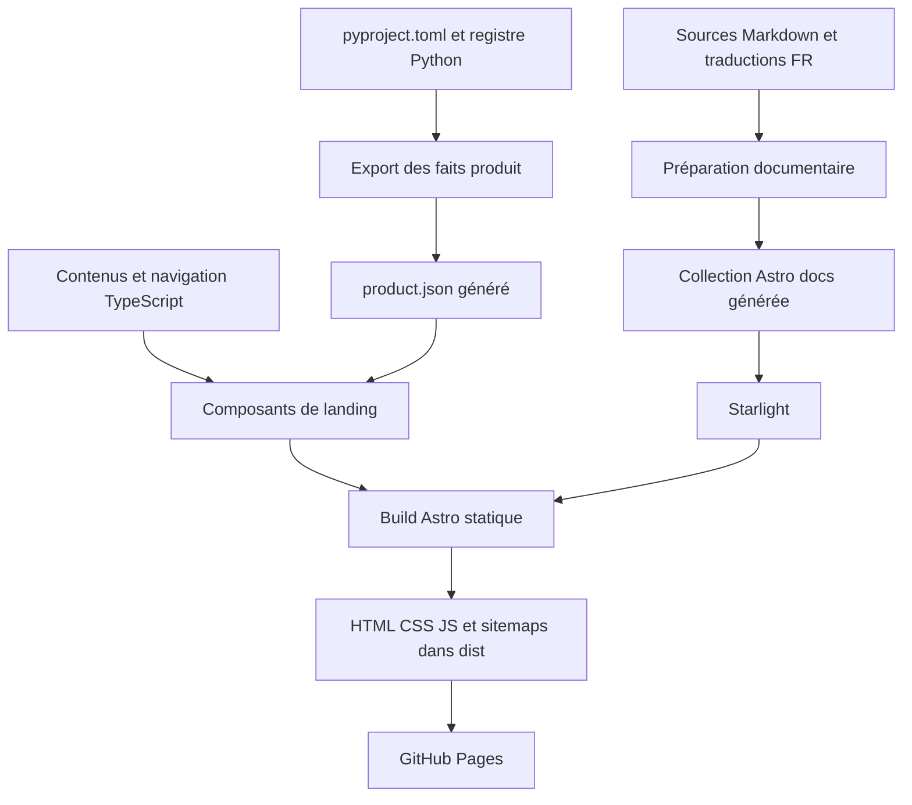

# Système de la landing Search Console MCP, référence pour créer un autre site

Document de transmission établi le 9 octobre 2026 et actualisé le 10 octobre 2026 à partir des fichiers locaux. Il décrit le site, son design system, ses composants, sa génération et sa validation. Les chemins ci-dessous sont absolus pour qu’une autre session puisse ouvrir directement les sources.

## 1. Quelle version lire

La référence est le checkout principal :

`/Users/florianbruniaux/Sites/perso/google-search-console-mcp`

Cette actualisation part du commit `a8b8ed9` de `main`, version `1.5.0`, avec 96 outils exportés depuis le registre Python. Le menu Compact est préparé sur la branche `codex/compact-site-header`. Les parcours par profil et le catalogue sont intégrés à la landing et aux plans du site.

Les chemins absolus ci-dessous pointent vers ce checkout. Sur une autre machine, remplacer ce préfixe par le chemin du dépôt cloné. Avant de reprendre le code, vérifier la branche, le HEAD et les modifications locales ; préserver les changements d’une autre session.

La configuration vise le domaine [Search Console MCP](https://search-console.bruniaux.com/). Ce document décrit le code local. Les résultats de vérification, de CI et de déploiement sont à consulter séparément dans la PR et ses workflows.

## 2. Choix techniques et séparation des responsabilités

Le site est une application **Astro statique** à l’intérieur du dépôt Python du produit. La landing utilise des composants `.astro`, des données TypeScript, du CSS natif et un script TypeScript pour les interactions. La documentation utilise **Starlight** dans le même build.

Les dépendances déclarées dans le package du site sont :

| Dépendance | Version déclarée | Rôle |
| --- | --- | --- |
| `astro` | `^5.17.1` | Pages, composants et génération HTML statique |
| `@astrojs/starlight` | `0.37.7` | Documentation, navigation et recherche documentaire |
| `@astrojs/sitemap` | `^3.7.0` | Sitemaps XML au build |
| `typescript` | `^5.9.3` | Types et contrôles de cohérence |
| `@astrojs/check` | `^0.9.10` | Vérification des fichiers Astro |
| `@playwright/test` | `^1.55.0` | Tests dans Chromium et captures de référence |
| `@axe-core/playwright` | `^4.10.2` | Contrôles automatisés d’accessibilité |

Ces valeurs décrivent le manifeste lu, pas les dernières versions disponibles. Le lockfile fixe la résolution installée.

- Manifeste : `/Users/florianbruniaux/Sites/perso/google-search-console-mcp/site/package.json`
- Lockfile : `/Users/florianbruniaux/Sites/perso/google-search-console-mcp/site/pnpm-lock.yaml`
- Configuration Astro : `/Users/florianbruniaux/Sites/perso/google-search-console-mcp/site/astro.config.mjs`
- TypeScript strict : `/Users/florianbruniaux/Sites/perso/google-search-console-mcp/site/tsconfig.json`

La configuration fixe `output: 'static'`, `base: '/'` et `trailingSlash: 'always'`. Elle déclare les langues anglaise et française, les intégrations, les adaptations de Starlight et sa sidebar.

La landing utilise des composants Astro et du CSS natif, sans React, Vue ou Tailwind. Le header réutilise l’icône GitHub fournie par Starlight ; les autres icônes du header sont des SVG décoratifs. Les polices sont celles du système. Le site public ne lance pas de serveur MCP et ne reçoit pas les identifiants Google ou Bing : il explique le produit, montre des exemples statiques et fournit des commandes et des prompts à copier. Le serveur Python intervient au build pour produire les faits du produit, puis dans le client MCP du visiteur lorsqu’il l’installe.



## 3. Architecture des fichiers et entrées du site

La répartition des responsabilités est la suivante :

| Couche | Chemin absolu | Responsabilité |
| --- | --- | --- |
| Pages | `/Users/florianbruniaux/Sites/perso/google-search-console-mcp/site/src/pages/` | Routes et choix de la langue |
| Layout | `/Users/florianbruniaux/Sites/perso/google-search-console-mcp/site/src/layouts/BaseLayout.astro` | Document HTML, métadonnées, thème initial et chargement des interactions |
| Composition | `/Users/florianbruniaux/Sites/perso/google-search-console-mcp/site/src/components/LandingPage.astro` | Assemblage de la landing et données structurées |
| Sections | `/Users/florianbruniaux/Sites/perso/google-search-console-mcp/site/src/components/` | Markup des sections et éléments partagés |
| Contenus | `/Users/florianbruniaux/Sites/perso/google-search-console-mcp/site/src/data/content.ts` | Textes EN/FR, destinations internes et liens externes |
| Navigation | `/Users/florianbruniaux/Sites/perso/google-search-console-mcp/site/src/data/navigation.ts` | Arbre des menus, groupes, descriptions et liens |
| Scénarios | `/Users/florianbruniaux/Sites/perso/google-search-console-mcp/site/src/data/seo-routes.ts` | Problèmes, résultats attendus et prompts associés |
| CSS landing | `/Users/florianbruniaux/Sites/perso/google-search-console-mcp/site/src/styles/global.css` | Tokens, styles communs, sections et responsive |
| Interactions | `/Users/florianbruniaux/Sites/perso/google-search-console-mcp/site/src/scripts/interactions.ts` | Menu, thème, copie et ouverture des scénarios |
| Génération | `/Users/florianbruniaux/Sites/perso/google-search-console-mcp/site/scripts/` | Préparation des faits produit et des contenus documentaires |
| Assets | `/Users/florianbruniaux/Sites/perso/google-search-console-mcp/site/public/` | Favicon, image sociale, fichiers de crawl et illustrations |
| Vérification | `/Users/florianbruniaux/Sites/perso/google-search-console-mcp/site/tests/` | Contenu HTML, SEO, comportements, accessibilité et captures |

Les pages d’accueil sont volontairement réduites à l’appel d’un composant commun :

- Anglais, `/` : `/Users/florianbruniaux/Sites/perso/google-search-console-mcp/site/src/pages/index.astro`
- Français, `/fr/` : `/Users/florianbruniaux/Sites/perso/google-search-console-mcp/site/src/pages/fr/index.astro`

Elles rendent respectivement `<LandingPage locale="en" />` et `<LandingPage locale="fr" />`. La même structure produit les deux versions ; la langue sélectionne les textes et les liens.

`BaseLayout.astro` accepte `title`, `description`, `image`, `imageAlt`, `lang`, `alternatePaths` et `jsonLd`. Il importe le CSS global et rend le contenu par un `<slot />`. Le header et le footer sont assemblés par les composants de page, pas imposés dans le layout. Cela permet aux pages secondaires de conserver leur contenu propre.

## 4. Design system

Le système visuel adapte l’identité BoldGuy avec des fonds clairs chauds, des fonds sombres neutres, un accent orange et une typographie système. Le monogramme `FB.` signe le header. L’interface alterne sections ouvertes, lignes séparatrices, surfaces teintées, cartes et blocs de code sombres.

Il s’agit d’un design system dans le CSS et le markup. Il n’existe pas de package autonome de tokens ni de catalogue Storybook dans les fichiers du site examinés.

### Tokens de couleur

Les variables sont déclarées sur `:root`, puis remplacées par `[data-theme="dark"]`.

| Token | Clair | Sombre |
| --- | --- | --- |
| `--bg-primary` | `#f5f0eb` | `#0a0a0a` |
| `--bg-secondary` | `#fef7f0` | `#141414` |
| `--bg-tertiary` | `#f0e8df` | `#1e1e1e` |
| `--surface-elevated` | `#ffffff` | `#141414` |
| `--border` | `#d4cdc5` | `#2a2a2a` |
| `--border-light` | `#e8dfd6` | `#1e1e1e` |
| `--text-primary` | `#1a1207` | `#e5e5e5` |
| `--text-secondary` | `#4a3f31` | `#a3a3a3` |
| `--text-muted` | `#6b6053` | `#8a8a8a` |
| `--accent` | `#c2410c` | `#f97316` |
| `--accent-hover` | `#9a3412` | `#fb923c` |
| `--success` | `#16a34a` | `#22c55e` |

Les couleurs de fournisseur sont `--provider-google: #4285f4` et `--provider-bing: #008373`. Le terminal et les blocs de code conservent une surface sombre, y compris en thème clair.

### Typographie et géométrie

- `--font-sans` utilise `system-ui`, les équivalents Apple et les polices système de repli. `--font-mono` utilise les fontes monospace locales.
- Corps de texte : `1rem`, interligne `1.6`. H1 : `clamp(2.45rem, 6vw, 4.7rem)`, graisse `750`, interligne `0.98`, espacement `-0.05em` et largeur maximale `15ch`.
- H2 : `2rem`, interligne `1.2`. Les titres utilisent `text-wrap: balance`.
- Conteneur principal : maximum `75rem`, largeur `min(100% - 3rem, var(--max-width))`. La composition du hero peut utiliser une enveloppe de `90rem`.
- Sections : `5rem` d’espace vertical, réduit à `3rem` sur mobile. Les boutons ont un rayon de `8px` ; les cartes et panneaux utilisent souvent `12px`.
- Header sticky : hauteur `56px`, fond légèrement transparent et flou de `14px`. Les ancres compensent le header avec le padding et les marges de scroll.

Les valeurs d’espacement et de rayon sont encore écrites directement dans les règles CSS. Pour un autre site, on peut les reprendre telles quelles ou les centraliser si plusieurs pages en ont besoin.

### Primitives réutilisées

Les classes `.container`, `.kicker`, `.section-heading`, `.section-tinted`, `.button`, `.button-primary`, `.button-secondary`, `.text-link`, `.boundary-note`, `.command-row`, `.copy-status` et `.sr-only` fournissent les motifs communs. Elles vivent dans le CSS global, sans composants Astro `Button` ou `Card` distincts.

Chaque section utilise généralement un élément `<section>`, un conteneur, un titre identifié et `aria-labelledby`. Les données alimentent des listes ou des cartes rendues avec `.map()`. La structure est commune ; le contenu est séparé dans les données lorsque cela évite de doubler les composants par langue.

### Responsive et mouvement

Les points de rupture de la landing lus dans le CSS sont :

| Seuil | Comportement |
| --- | --- |
| Moins de `72rem` | Header remplacé par le tiroir mobile ; même seuil dans le script |
| Au plus `56rem` | Hero et installation passent à une colonne |
| Au plus `48rem` | Marges réduites, CTA empilés, fournisseurs/workflow sur une colonne, preuve sur deux colonnes et footer adapté |
| Au plus `800px` | Adaptation des lignes de scénarios et de l’exemple d’audit |

`prefers-reduced-motion: reduce` neutralise les animations et les transitions. Les grilles utilisent `minmax(0, …)`, les contenus longs peuvent se replier et les commandes défilent à l’intérieur de leur bloc pour éviter de faire déborder tout le document.

## 5. Composition de la landing et composants

`LandingPage.astro` assemble le header, le bandeau de nouveautés, douze blocs de contenu et le footer, dans cet ordre :

| Composant | Rôle et destination | Chemin absolu |
| --- | --- | --- |
| `SiteHeader` | Marque, menus, installation, documentation, langue, GitHub et thème | `/Users/florianbruniaux/Sites/perso/google-search-console-mcp/site/src/components/SiteHeader.astro` |
| `UpdatesBanner` | Date et statut de la dernière évolution, lien vers les nouveautés | `/Users/florianbruniaux/Sites/perso/google-search-console-mcp/site/src/components/UpdatesBanner.astro` |
| `Hero` | Promesse, commande copiable, chemin d’installation, entrées par problème et exemple illustratif | `/Users/florianbruniaux/Sites/perso/google-search-console-mcp/site/src/components/Hero.astro` |
| `ProofStrip` | Quatre faits produit, dont le nombre d’outils généré | `/Users/florianbruniaux/Sites/perso/google-search-console-mcp/site/src/components/ProofStrip.astro` |
| `AuditCoverage` | Six catégories de contrôles avec liens vers le catalogue ; `#audit-checks` | `/Users/florianbruniaux/Sites/perso/google-search-console-mcp/site/src/components/AuditCoverage.astro` |
| `SeoCaseStudy` | Exemple daté avec métriques, constats, propositions et trace ; `#real-example` | `/Users/florianbruniaux/Sites/perso/google-search-console-mcp/site/src/components/SeoCaseStudy.astro` |
| `PersonaPaths` | Quatre parcours par métier ; `#personas` | `/Users/florianbruniaux/Sites/perso/google-search-console-mcp/site/src/components/PersonaPaths.astro` |
| `SeoOutcomes` | Parcours problème, analyse, résultat et prompts ; ancre `#outcomes` | `/Users/florianbruniaux/Sites/perso/google-search-console-mcp/site/src/components/SeoOutcomes.astro` |
| `ProviderCoverage` | Trois cartes Google, Bing et pages publiques ; `#capabilities` | `/Users/florianbruniaux/Sites/perso/google-search-console-mcp/site/src/components/ProviderCoverage.astro` |
| `Workflow` | Cinq étapes : connecter, demander, analyser, corriger, mesurer ; `#workflow` | `/Users/florianbruniaux/Sites/perso/google-search-console-mcp/site/src/components/Workflow.astro` |
| `InstallPath` | Évaluation, installation durable et vérification ; `#install` | `/Users/florianbruniaux/Sites/perso/google-search-console-mcp/site/src/components/InstallPath.astro` |
| `EvidenceSafety` | États observé, calculé et demandé ; `#safety` | `/Users/florianbruniaux/Sites/perso/google-search-console-mcp/site/src/components/EvidenceSafety.astro` |
| `Faq` | Questions/réponses avec `<details>` natifs ; `#faq` | `/Users/florianbruniaux/Sites/perso/google-search-console-mcp/site/src/components/Faq.astro` |
| `FinalInstall` | CTA final et commande copiable ; `#final-install` | `/Users/florianbruniaux/Sites/perso/google-search-console-mcp/site/src/components/FinalInstall.astro` |
| `SiteFooter` | Navigation, produit, écosystème et auteur | `/Users/florianbruniaux/Sites/perso/google-search-console-mcp/site/src/components/SiteFooter.astro` |

L’ordre fait passer le lecteur de son objectif à un exemple concret, puis au périmètre du produit et à son installation. La preuve n’est pas un carrousel de témoignages : les faits changeants viennent du registre et l’exemple réel vient d’un fichier de données relu.

`SeoOutcomes` présente quatre problèmes dans une grille avec des flèches SVG. Chaque ligne mène à un `<details>` identifié par `#seo-…`, contenant les prérequis, le prompt copiable, un exemple et le guide correspondant. Le texte reste sélectionnable si la copie échoue. Le code est réparti entre le composant, `seo-routes.ts` et `interactions.ts`.

`SeoCaseStudy` importe un exemple daté, formate les nombres selon la langue et distingue les métriques des actions proposées. Son fichier source est :

`/Users/florianbruniaux/Sites/perso/google-search-console-mcp/examples/evidence/2026-10-07-cc-guide.json`

La trace est aussi préparée pour téléchargement dans le répertoire public. Pour un autre produit, remplacer cet exemple par ses propres données partageables ; conserver la distinction entre une illustration et un résultat réellement mesuré.

## 6. Menu desktop, mobile et interactions

Le menu utilise **un seul arbre de navigation** pour les panneaux desktop et le tiroir mobile. Le modèle `NavigationSection` contient un identifiant, un libellé, une description, un lien d’orientation et des groupes de liens. Chaque lien peut déclarer `external`.

Les trois sections du menu sont :

| Menu français | Menu anglais | Contenu |
| --- | --- | --- |
| Analyser | Analyze | Fournisseurs, choix d’un problème, exemple réel, workflow, limites et FAQ |
| Votre parcours | Your path | Quatre métiers, installation guidée, catalogue et prompts de démarrage |
| Ressources | Resources | GitHub, PyPI, nouveautés, plan du site, architecture, installation, sécurité et licence |

Le groupe Compact à droite affiche la documentation, un séparateur, le globe et le code FR/EN, le logo GitHub, le thème sans cadre et le bouton orange Installer/Install avec une flèche. Le lien GitHub garde un nom accessible et l’annonce d’ouverture dans un nouvel onglet. Les icônes sont décoratives ; le bouton de thème garde son libellé accessible localisé.

Le header et le bandeau utilisent les mêmes largeur et marges internes que le hero. Leur largeur maximale est `90rem`, avec des marges internes progressives limitées à `3rem` sur grand écran. Les cibles de navigation restent hautes d’au moins `44px`.

### Desktop

Chaque section utilise `<details>` et `<summary>`. Le panneau se positionne sous le header, dans une largeur maximale de `72rem`. Il contient une ligne de présentation et deux groupes éditoriaux séparés par des bordures. Le script assure l’ouverture d’un seul panneau, la synchronisation de `aria-expanded`, l’entrée au clavier avec `ArrowDown`, la fermeture avec `Escape` et le retour du focus au déclencheur. Un clic hors du header ferme les panneaux.

### Mobile

Le bouton `#mobile-menu-toggle` ouvre le même contenu dans un tiroir à droite, de largeur `min(26rem, 100% - 1rem)` et hauteur `100dvh`. Le script ajoute `role="dialog"` et `aria-modal="true"`, affiche le backdrop et place le focus sur la fermeture. Le CSS bloque le scroll du corps avec `body[data-nav-open]`.

Le tiroir contient le focus avec `Tab` et `Shift+Tab`. Il se ferme avec le bouton, le backdrop, `Escape` ou un lien. Pour une ancre de la page, le focus rejoint la section ciblée. Le passage au desktop à `72rem` réinitialise l’état mobile. Dans le tiroir, la documentation occupe une ligne, les commandes langue/GitHub/thème une ligne de trois colonnes et Installer la largeur complète. Les libellés restent sur une ligne à partir de `320px`.

### Pages secondaires

Le header accepte `alternatePaths` pour basculer vers la traduction de la page courante. Sa fonction `hrefFor` transforme les ancres de landing en liens vers l’accueil quand le visiteur se trouve sur une page secondaire. Le footer applique la même logique aux liens de section.

### Thème et copie

Un script inline dans le `<head>` lit `localStorage.theme`, puis la préférence système, avant le rendu. Les exceptions de stockage sont interceptées. Le bouton de thème modifie `data-theme`, mémorise le choix et adapte son libellé accessible.

Les boutons de copie utilisent `data-copy-command` ou `data-copy-prompt`. `aria-controls` désigne leur zone de retour locale, avec `role="status"` et `aria-live="polite"`. Le script appelle `navigator.clipboard.writeText`, puis annonce le succès ou l’échec dans la langue courante. Les différents boutons ne partagent pas un message global.

## 7. Footer

Le footer contient une ligne de marque avec la signature `>_ Search Console MCP`, une description, trois groupes de liens et une ligne auteur.

- Navigation : sections de la landing et plan du site HTML.
- Produit : documentation, dépôt, package, installation, historique, licence et nouveautés.
- Écosystème : autres projets de Florian.
- Auteur : attribution, portfolio, blog, profil GitHub et LinkedIn.

Les textes et les destinations sont centralisés dans `content.ts`. Le composant construit ses groupes à partir de ces données. Dans le code existant, les libellés du produit et de l’écosystème sont associés aux destinations par leur index ; si une autre session change leur ordre ou ajoute des liens, elle doit vérifier cet alignement.

Les URL HTTP externes reçoivent `target="_blank"`, `rel="noopener noreferrer"`, une indication visuelle et une annonce pour les lecteurs d’écran. Le footer se réorganise sur mobile, avec les liens en deux colonnes. Il ne contient pas de formulaire ni de collecte de contacts.

## 8. Documentation Starlight et sources canoniques

La documentation est un second mode de rendu dans le même site. Starlight fournit son header, sa sidebar, son sommaire de page, sa pagination, sa recherche et ses contrôles de langue/thème. La landing conserve son propre header : ce ne sont pas deux exemplaires du même composant.

La configuration de la collection est :

`/Users/florianbruniaux/Sites/perso/google-search-console-mcp/site/src/content.config.ts`

Elle utilise `docsLoader()` et `docsSchema()`, étendus avec les champs optionnels `canonicalSource` et `canonicalEnglish`.

### Génération documentaire

Le script suivant possède la liste explicite `publishedPages` et prépare le corpus publié :

`/Users/florianbruniaux/Sites/perso/google-search-console-mcp/site/scripts/prepare-doc-content.mjs`

Il lit les sources retenues dans le dépôt, retire leur H1 initial, ajoute le frontmatter et convertit les liens Markdown connus en routes publiques. Il échoue lorsqu’une source manque ou qu’un lien interne n’est pas mappé. Il supprime les fichiers Markdown générés devenus inattendus, copie les traductions françaises et vérifie la frontière de publication.

Les sources se trouvent dans :

- Guides canoniques : `/Users/florianbruniaux/Sites/perso/google-search-console-mcp/docs/`
- Scénarios canoniques : `/Users/florianbruniaux/Sites/perso/google-search-console-mcp/examples/`
- Historique : `/Users/florianbruniaux/Sites/perso/google-search-console-mcp/CHANGELOG.md`
- Licence : `/Users/florianbruniaux/Sites/perso/google-search-console-mcp/LICENSE`
- Pages propres au portail EN : `/Users/florianbruniaux/Sites/perso/google-search-console-mcp/site/content/en/`
- Traductions FR maintenues : `/Users/florianbruniaux/Sites/perso/google-search-console-mcp/site/content/fr/docs/`
- Manifest de correspondance et empreintes : `/Users/florianbruniaux/Sites/perso/google-search-console-mcp/site/content/fr/manifest.json`

La sortie est `/Users/florianbruniaux/Sites/perso/google-search-console-mcp/site/src/content/docs/`. **Ce répertoire est généré et ignoré par Git. Ne pas l’éditer comme source.**

Dans l’état lu, la liste contient 22 pages canoniques et leurs 22 traductions. Les routes sont `/docs/…` et `/fr/docs/…`. La sidebar organise les contenus en Démarrer, Utiliser, Comprendre et Projet, avec un sous-groupe Scénarios.

Le manifest compare l’empreinte de la source anglaise avec celle enregistrée lors de la revue française. Une traduction périmée produit un avertissement pendant la préparation ordinaire et une erreur avec `--verify-translations`. Le build ne traduit pas automatiquement.

La publication repose sur une liste de sources autorisées. Les espaces internes `docs/superpowers/`, `docs/machine-readable/` et `docs/validation/` sont bloqués. La trace publique datée a une empreinte approuvée ; sa modification exige une nouvelle revue avant publication.

### Adaptations visuelles et composants documentaires

- Tokens Starlight et styles de lecture : `/Users/florianbruniaux/Sites/perso/google-search-console-mcp/site/src/styles/starlight-overrides.css`
- Métadonnées et `x-default` : `/Users/florianbruniaux/Sites/perso/google-search-console-mcp/site/src/components/docs/Head.astro`
- Monogramme et retour vers l’accueil de la bonne langue : `/Users/florianbruniaux/Sites/perso/google-search-console-mcp/site/src/components/docs/SiteTitle.astro`
- Footer natif complété par plan du site/nouveautés et blocs de code accessibles au clavier : `/Users/florianbruniaux/Sites/perso/google-search-console-mcp/site/src/components/docs/DocsFooter.astro`

Le CSS documentaire utilise les variables `--sl-*` plutôt que les variables de landing. Il reprend la palette et les polices, fixe la largeur de contenu à `48rem` et la sidebar à `18.5rem`. Les deux systèmes restent cohérents visuellement mais ont des noms de tokens distincts.

Les deux illustrations documentaires sont :

- `/Users/florianbruniaux/Sites/perso/google-search-console-mcp/site/public/images/docs/search-evidence-map.webp`
- `/Users/florianbruniaux/Sites/perso/google-search-console-mcp/site/public/images/docs/guarded-action-loop.webp`

## 9. Sitemaps, nouveautés et SEO

### Plan du site HTML

Le plan du site destiné aux lecteurs est rendu aux routes `/sitemap/` et `/fr/sitemap/` :

- `/Users/florianbruniaux/Sites/perso/google-search-console-mcp/site/src/pages/sitemap.astro`
- `/Users/florianbruniaux/Sites/perso/google-search-console-mcp/site/src/pages/fr/sitemap.astro`
- Composant partagé : `/Users/florianbruniaux/Sites/perso/google-search-console-mcp/site/src/components/DiscoveryPage.astro`

`DiscoveryPage` lit la collection `docs`, sélectionne la langue et organise les destinations par usage. Les scénarios sont dérivés de la collection ; les autres groupes ont une liste explicite. Une page attendue manquante provoque une erreur. Le plan du site est relié depuis les ressources, le footer et le footer documentaire.

### Sitemaps XML et fichiers publics

L’intégration `sitemap()` dans `astro.config.mjs` génère les fichiers XML au build. Ils sont distincts du plan HTML. Les sorties attendues comprennent `site/dist/sitemap-index.xml` et les fichiers XML de pages produits par l’intégration.

Les fichiers publics à reprendre ou adapter sont :

- Robots : `/Users/florianbruniaux/Sites/perso/google-search-console-mcp/site/public/robots.txt`
- Domaine GitHub Pages : `/Users/florianbruniaux/Sites/perso/google-search-console-mcp/site/public/CNAME`
- Repères documentaires pour assistants : `/Users/florianbruniaux/Sites/perso/google-search-console-mcp/site/public/llms.txt`
- Favicon SVG : `/Users/florianbruniaux/Sites/perso/google-search-console-mcp/site/public/favicon.svg`
- Image sociale PNG : `/Users/florianbruniaux/Sites/perso/google-search-console-mcp/site/public/og-image.png`

`robots.txt` autorise le crawl et déclare le sitemap XML du domaine configuré. L’image sociale est contrôlée dans les tests pour le format `1200 × 630`. Changer le domaine implique de modifier la configuration, `CNAME`, `robots.txt`, `llms.txt` et les attentes de tests correspondantes.

### Nouveautés datées

Les pages `/updates/` et `/fr/updates/` réutilisent `DiscoveryPage` :

- `/Users/florianbruniaux/Sites/perso/google-search-console-mcp/site/src/pages/updates.astro`
- `/Users/florianbruniaux/Sites/perso/google-search-console-mcp/site/src/pages/fr/updates.astro`
- Lecture des dates : `/Users/florianbruniaux/Sites/perso/google-search-console-mcp/site/src/data/updates.mjs`

Le bandeau et la page utilisent le changelog canonique. `latestUpdate` reconnaît une section `Unreleased` non vide accompagnée de `<!-- unreleased-updated: YYYY-MM-DD -->`, sinon la dernière release datée. Les dates viennent de la source et ne changent pas à chaque build. Le texte différencie un changement sur `main` d’une version publiée sur PyPI ; il ne fait pas de requête PyPI en direct pour prouver ce statut.

La page affiche un résumé, les cinq premières entrées de version, un repli pour les suivantes et le contenu du changelog localisé.

### Métadonnées

Le layout génère la canonical depuis `Astro.url.pathname` et `Astro.site`. Il fournit le titre, la description, la langue HTML, les alternates `en`/`fr`/`x-default`, Open Graph et la carte Twitter avec une image sociale.

`LandingPage` ajoute un `SoftwareApplication` avec la version du produit et un `FAQPage` dont les questions/réponses viennent des mêmes données que la FAQ visible. Ce mécanisme est à conserver ; le type de données structurées et les attributs métier sont à adapter au nouveau site.

## 10. Faits produit générés

Le script Python lit le package et le registre réel, puis écrit un JSON de manière atomique. La landing n’a pas à dupliquer manuellement la version et le nombre d’outils.

- Exporteur : `/Users/florianbruniaux/Sites/perso/google-search-console-mcp/site/scripts/export-product-data.py`
- Métadonnées package : `/Users/florianbruniaux/Sites/perso/google-search-console-mcp/pyproject.toml`
- Registre : `/Users/florianbruniaux/Sites/perso/google-search-console-mcp/src/gsc_mcp/registry.py`
- Sortie générée : `/Users/florianbruniaux/Sites/perso/google-search-console-mcp/site/src/generated/product.json`
- Tests du contrat : `/Users/florianbruniaux/Sites/perso/google-search-console-mcp/tests/test_site_product_data.py`

Le contrat de base expose `package`, `version`, `toolCount`, `pythonRequires` et `repository`. L’import du registre exige les dépendances Python du produit. Un export invalide échoue au lieu de laisser le build poursuivre normalement. La sortie est ignorée par Git.

Le contrat inclut également le tableau `tools`, avec famille, description, signature et emplacement du code, utilisé par le catalogue détaillé décrit ci-dessous. Pour un site sans produit Python, garder le principe des faits provenant d’une source canonique, mais remplacer cet exporteur par la source adaptée au projet.

## 11. Parcours par profil et catalogue intégrés

`LandingPage.astro` rend `PersonaPaths` et `AuditCoverage`. Le menu Votre parcours/Your path utilise les profils de `journeys.ts`, et le plan HTML liste les pages par métier ainsi que le catalogue. Ces composants utilisent les mêmes header, footer, liens de langue et tokens que la landing.

| Fichier | Chemin absolu | Fonction |
| --- | --- | --- |
| `journeys.ts` | `/Users/florianbruniaux/Sites/perso/google-search-console-mcp/site/src/data/journeys.ts` | Quatre profils, routes localisées, demandes, contrôles et outils associés |
| `PersonaPaths.astro` | `/Users/florianbruniaux/Sites/perso/google-search-console-mcp/site/src/components/PersonaPaths.astro` | Entrées vers les parcours depuis une section `#personas` |
| `JourneyPage.astro` | `/Users/florianbruniaux/Sites/perso/google-search-console-mcp/site/src/components/JourneyPage.astro` | Hero de profil, démarrage guidé, contrôles, limites et prompt |
| Route EN | `/Users/florianbruniaux/Sites/perso/google-search-console-mcp/site/src/pages/for/[profile].astro` | Pages statiques via `getStaticPaths()` |
| Route FR | `/Users/florianbruniaux/Sites/perso/google-search-console-mcp/site/src/pages/fr/pour/[profile].astro` | Équivalents français avec slugs traduits |
| `ToolCatalogue.astro` | `/Users/florianbruniaux/Sites/perso/google-search-console-mcp/site/src/components/ToolCatalogue.astro` | Catalogue dérivé du registre, familles, signatures et liens source |
| `tool-families.ts` | `/Users/florianbruniaux/Sites/perso/google-search-console-mcp/site/src/data/tool-families.ts` | Explications EN/FR des familles et repérage des écritures externes |
| `AuditCoverage.astro` | `/Users/florianbruniaux/Sites/perso/google-search-console-mcp/site/src/components/AuditCoverage.astro` | Six catégories de contrôles avec liens vers le catalogue |
| Catalogue EN | `/Users/florianbruniaux/Sites/perso/google-search-console-mcp/site/src/pages/tools.astro` | Route `/tools/` |
| Catalogue FR | `/Users/florianbruniaux/Sites/perso/google-search-console-mcp/site/src/pages/fr/tools.astro` | Route `/fr/tools/` |
| Test de découverte | `/Users/florianbruniaux/Sites/perso/google-search-console-mcp/site/tests/dist-journeys.test.mjs` | Découvrabilité des parcours et du catalogue |

Les profils sont propriétaire de site, expert SEO, équipe contenu et développeur. Les routes anglaises utilisent `site-owners`, `seo-experts`, `content-teams`, `developers`, et les françaises `proprietaires`, `experts-seo`, `equipes-contenu`, `developpeurs`.

Le motif transférable est une page par objectif ou rôle, avec un chemin guidé et un accès aux détails sur la même page. Les tests de découverte vérifient les routes et les liens ; les tests navigateur vérifient leur navigation et leur rendu aux largeurs et thèmes couverts.

## 12. Validation, captures et déploiement

### Commandes du projet

Le manifeste du site prépare les données et la documentation avant `dev`, `check` et `build`. La commande `verify` enchaîne les tests des sources documentaires, le contrôle des traductions, le contrôle Astro, le build, les tests du HTML et les tests navigateur.

Pour reprendre ces commandes dans le site de référence, les prérequis sont Node 22, pnpm 9, Python compatible avec le produit, ses dépendances installées et Chromium Playwright. Les deux premières versions sont celles utilisées par la CI ; elles ne constituent pas une recommandation de version la plus récente.

```sh
cd /Users/florianbruniaux/Sites/perso/google-search-console-mcp/site
rtk proxy pnpm install --frozen-lockfile
rtk proxy pnpm dev
```

Pour la vérification complète, arrêter le serveur de développement puis utiliser :

```sh
cd /Users/florianbruniaux/Sites/perso/google-search-console-mcp/site
rtk proxy pnpm verify
```

Ces commandes régénèrent les sorties. Ne pas les lancer dans un worktree modifié par une autre session sans coordination. Pour utiliser le Python du projet, activer son environnement virtuel avant les commandes du site.

### Répartition des vérifications

| Fichier | Chemin absolu | Ce qu’il contrôle |
| --- | --- | --- |
| Sources documentaires | `/Users/florianbruniaux/Sites/perso/google-search-console-mcp/site/tests/doc-content-source.test.mjs` | Liste des pages, frontmatter, liens, dates, preuves publiables et illustrations |
| Contenu construit | `/Users/florianbruniaux/Sites/perso/google-search-console-mcp/site/tests/dist-content.test.mjs` | Sections, langues, ancres uniques, navigation, CTA, FAQ et footer |
| SEO construit | `/Users/florianbruniaux/Sites/perso/google-search-console-mcp/site/tests/dist-seo.test.mjs` | Canonical, alternates, JSON-LD, robots, sitemap, image sociale et absence de chemins locaux dans le HTML d’accueil |
| Découverte | `/Users/florianbruniaux/Sites/perso/google-search-console-mcp/site/tests/dist-discovery.test.mjs` | Plan HTML, nouveautés, statut de release, accès depuis le site et changement de langue |
| Navigateur | `/Users/florianbruniaux/Sites/perso/google-search-console-mcp/site/tests/site.spec.ts` | Menu clavier/mobile, focus, thème, copie, scénarios, documentation, accessibilité et débordement |
| Configuration E2E | `/Users/florianbruniaux/Sites/perso/google-search-console-mcp/site/playwright.config.ts` | Chromium, serveur de preview sur `127.0.0.1:4321`, traces d’échec |
| Captures de référence | `/Users/florianbruniaux/Sites/perso/google-search-console-mcp/site/tests/site.spec.ts-snapshots/` | Landing EN/FR, clair/sombre, desktop/mobile, menus, FAQ et documentation |

Les tests de débordement couvrent notamment les largeurs `390`, `768`, `800`, `1024`, `1280` et `1440px`. Les contrôles Axe comparent les langues et les thèmes à `390` et `1440px`, avec des états de menu ouverts pour le parcours anglais. Les captures de référence ont été établies sous Chromium/macOS ; la suite saute leurs comparaisons lorsque `CI` est activé. Une reprise doit conserver cette distinction entre références locales et CI Linux.

Une nouvelle page doit vérifier ses liens et ancres, la langue, la navigation clavier, le responsive et le rendu clair/sombre. Un contrôle de types ne prouve pas le fonctionnement du menu ; les tests navigateur servent à cette vérification. Les tests du menu Compact vérifient aussi l’alignement des deux bords du header et du bandeau sur le hero à `1024`, `1280`, `1440` et `1920px`, puis la lisibilité des actions du tiroir en EN/FR à `320`, `390` et `1024px`.

### GitHub Pages

Workflow :

`/Users/florianbruniaux/Sites/perso/google-search-console-mcp/.github/workflows/site.yml`

Il se déclenche sur `main` pour les chemins du site, du package, du serveur et du workflow, ou manuellement. Le workflow `/Users/florianbruniaux/Sites/perso/google-search-console-mcp/.github/workflows/ci.yml` vérifie également le site sur les PR autorisées, sans déploiement, en parallèle de la suite Python. Il installe Python et le produit, teste l’exporteur, installe Node/pnpm et Chromium, puis exécute `pnpm verify`.

Après validation, il ajoute un fichier `deployment.json` contenant le SHA et l’identifiant du run, charge l’artefact `site/dist/` et déploie dans l’environnement `github-pages`. Les permissions de publication Pages sont portées par le job de déploiement.

La publication du package Python reste dans un autre workflow :

`/Users/florianbruniaux/Sites/perso/google-search-console-mcp/.github/workflows/publish.yml`

Pour un nouveau site, reprendre le build et la validation adaptés à son produit, changer le domaine et vérifier ensuite l’artefact effectivement servi. La présence du workflow ne prouve pas qu’un déploiement particulier a réussi.

## 13. Documents de conception à consulter

La conception initiale et l’évolution documentaire sont conservées dans :

- `/Users/florianbruniaux/Sites/perso/google-search-console-mcp/docs/superpowers/specs/2026-10-06-search-console-site-design.md`
- `/Users/florianbruniaux/Sites/perso/google-search-console-mcp/docs/superpowers/specs/2026-10-06-bilingual-docs-portal-design.md`
- `/Users/florianbruniaux/Sites/perso/google-search-console-mcp/docs/superpowers/plans/2026-10-06-search-console-site.md`

La première spécification explique le site statique dans le dépôt existant, les critères de navigation/accessibilité et le menu inspiré de celui du Claude Code Ultimate Guide. La seconde décrit l’ajout de Starlight, des traductions et de la frontière de publication.

Ces fichiers sont historiques. Ils contiennent des périmètres initiaux et des textes remplacés depuis, notamment les exclusions initiales de Starlight et des traductions, l’ancien hero et l’ancienne bande de preuves. Le code actuel et cette description de son état priment pour une reproduction. La liste exacte des outils et agents ayant participé à chaque session n’a pas été reconstituée ; les fichiers donnent les décisions et le processus prévu, pas une preuve exhaustive de son exécution.

## 14. Instructions à transmettre à la session qui créera le nouveau site

Utilise ce document et les fichiers absolus qu’il référence comme base d’architecture et de design pour le nouveau site. Commence par lire la configuration Astro, `BaseLayout`, `LandingPage`, le CSS global, `content.ts`, `navigation.ts`, les interactions, le header et le footer. Lis les composants documentaires et les scripts de génération si le nouveau site a besoin d’une documentation.

Construis le nouveau site dans son propre projet. Reprends la séparation entre routes, layout, sections, contenus, navigation, CSS et interactions. Adapte la promesse, l’action principale, les sections, les liens et les exemples au produit demandé. Les commandes MCP, les fournisseurs Google/Bing, les chiffres et l’exemple SEO appartiennent au site source et ne doivent pas devenir des faits du nouveau produit.

Garde le menu accessible au clavier, le tiroir mobile, le thème clair/sombre sans flash initial, les retours de copie locaux, les ancres cohérentes et le footer adapté aux pages secondaires. Pour une navigation par profil, reprends le modèle de `journeys.ts` et adapte les métiers, les slugs et les parcours au nouveau produit.

Pour une documentation, maintiens les sources canoniques, une liste explicite de pages publiées, les traductions contrôlées et les sorties générées séparées des sources. Pour les chiffres affichés, utilise une source réelle adaptée au nouveau produit. Configure son domaine, ses métadonnées, son image sociale, son plan HTML et ses sitemaps XML.

Vérifie les routes, les liens, le contenu bilingue lorsqu’il est demandé, les comportements clavier et mobile, l’absence de débordement et le rendu dans les deux thèmes. Réutilise les intentions des tests ; adapte leurs attentes et les captures au contenu du nouveau site. Rapporte séparément les résultats locaux, l’état de CI et l’état du déploiement.
