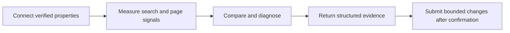

# Search Console MCP website design

| Field | Value |
| --- | --- |
| Status | Proposed for human review |
| Date | 2026-10-06 |
| Repository | `FlorianBruniaux/google-search-console-mcp` |
| Public URL | `https://search-console.bruniaux.com/` |

## Decision

Build one static Astro landing page inside `site/` in the existing repository. GitHub Pages publishes the generated site through a dedicated workflow. The PyPI release workflow remains separate.

The public product name is **Search Console MCP**. The package name remains `gsc-mcp-tools`. The page explains the product, proves its current scope from repository data, gives one short installation path and sends readers to the existing documentation for configuration details.

## Product goal

The page must help a developer or SEO practitioner answer three questions without reading the full README:

1. What does Search Console MCP connect to an AI assistant?
2. What can it measure or change, and where are the safety boundaries?
3. How can I install it and verify the first connection?

The primary conversion is a copy of `uvx gsc-mcp-tools` or a click to the installation guide. GitHub and PyPI are supporting destinations.

## Audiences

| Audience | Need | Page response |
| --- | --- | --- |
| Developer using Claude, Codex or another MCP client | Install a working MCP server without learning the codebase | A visible command, supported runtime, client links and verification step |
| SEO practitioner with Google or Bing properties | Understand the available data and cross-engine limits | Provider coverage, workflow and explicit evidence boundaries |
| Maintainer evaluating the project | Check scope, release, source and safeguards | Generated product facts, GitHub link, license and guarded-write explanation |

## Success criteria

The design is accepted when the implemented site meets these observable conditions:

- A first-time visitor can identify Google Search Console, Bing Webmaster Tools, GA4, CrUX and IndexNow above the fold or in the first viewport transition.
- The install command can be copied with keyboard and pointer input.
- The desktop header exposes one intent panel at a time, supports Arrow Down and Escape, and restores focus to the trigger when dismissed.
- The mobile header exposes the same destinations in a modal navigation drawer with a close control, backdrop dismissal and focus containment.
- The current package version and tool count come from repository sources during the build.
- A failed product-data export fails the site build instead of publishing stale numbers.
- The page states that an accepted submission does not prove crawl or indexation.
- The page renders without document-level horizontal overflow at 390 px and 1440 px.
- All controls expose a visible keyboard focus and a target of at least 44 px.
- The production artifact contains a canonical URL, Open Graph metadata, a sitemap, `robots.txt` and valid visible FAQ content matching its structured data.
- The Pages workflow can deploy without running the PyPI publishing job.

These criteria do not prove search-engine indexation, ranking gains, user conversion or production API connectivity.

## Scope

### Included in the first release

- One page at `/`.
- Responsive light and dark themes.
- Static HTML, CSS and minimal browser JavaScript.
- Hero, proof strip, installation path, provider coverage, product workflow, safety boundary, FAQ and footer.
- Generated version and tool count.
- GitHub Pages deployment for `search-console.bruniaux.com`.
- SEO and social metadata.

### Excluded from the first release

- Starlight documentation portal.
- Blog, changelog UI, client-side search, account, dashboard or API proxy.
- React, Vue, Tailwind, a component library or a web-font dependency.
- Analytics, consent banner, newsletter form or lead capture.
- A complete browser-rendered catalogue of all tools.
- Translations.

The existing README and files under `docs/` remain the detailed documentation source.

## Repository architecture

```text
google-search-console-mcp/
├── site/
│   ├── astro.config.mjs
│   ├── package.json
│   ├── public/
│   │   ├── CNAME
│   │   ├── favicon.svg
│   │   ├── og-image.png
│   │   └── robots.txt
│   ├── scripts/
│   │   └── export-product-data.py
│   └── src/
│       ├── components/
│       ├── generated/product.json
│       ├── layouts/BaseLayout.astro
│       ├── pages/index.astro
│       └── styles/global.css
├── .github/workflows/site.yml
├── pyproject.toml
└── src/gsc_mcp/registry.py
```

Astro uses `https://search-console.bruniaux.com` as `site` and `/` as `base`. The Pages artifact is `site/dist`. The implementation must not change package import paths or move the Python project.

## Product-data contract

`site/scripts/export-product-data.py` reads the package metadata from `pyproject.toml` and imports `TOOLS` from `src/gsc_mcp/registry.py` after the project dependencies are installed. It writes `site/src/generated/product.json` before local development and production builds.

The first contract contains only values that the page renders as changing product facts:

```json
{
  "package": "gsc-mcp-tools",
  "version": "1.2.0",
  "toolCount": 81,
  "pythonRequires": ">=3.11",
  "repository": "https://github.com/FlorianBruniaux/google-search-console-mcp"
}
```

Rules:

- `toolCount` equals `len(TOOLS)`.
- The exporter validates required keys and types.
- The exporter uses deterministic JSON formatting.
- A missing dependency, import failure, empty registry or malformed project metadata exits non-zero.
- `npm run dev` and `npm run build` invoke the exporter first.
- CI compares a second export with the first to detect nondeterministic output.
- Marketing copy may describe stable capability groups, but it must not duplicate changing counts.

The implementation begins with a failing exporter-contract test. Astro work starts after that test passes.

## Information architecture

### Fixed header

The 56 px header adapts the intent-menu pattern observed on the Claude Code Ultimate Guide without copying its logo, labels, search control, announcement bar or product content. It contains the `>_ Search Console MCP` wordmark, three intent menus, a direct GitHub action and a theme toggle. The page includes a skip link to the main content.

The desktop menus are:

- **Analyze:** Google data, Bing data and public-page analysis in one group; workflow and evidence boundaries in a second group.
- **Start:** evaluation, persistent installation and access verification in one group; Google setup, Bing setup and starter prompts in a second group.
- **Resources:** GitHub, PyPI, changelog and architecture in one group; installation documentation, Bing API contract, license and FAQ in a second group.

Each trigger uses a chevron and a 44 px minimum target. An open trigger receives an orange bottom border. Its panel appears directly below the header, stays within a 72 rem centered shell, and uses a heading row plus two bordered editorial groups. Only one desktop panel can remain open.

Desktop keyboard behavior is explicit: Enter or Space toggles a panel, Arrow Down opens it and moves focus to its first link, Escape closes it and restores focus to its trigger. A click outside closes the active panel. External destinations expose an external-link label to assistive technology.

Below 64 rem, a menu button opens a modal drawer from the right over a backdrop. The same three intent groups become vertical disclosures. The drawer has a visible close control, traps focus between its controls, closes from the backdrop or a selected link, restores focus to the menu button and clears its state when the viewport crosses back to desktop.

The first release has no search action or announcement bar because the site has one page and no searchable content corpus or dated update feed.

### Hero

The hero uses the headline **Search data your AI assistant can inspect, compare and act on safely.** Supporting copy names Google Search Console, Bing Webmaster Tools, GA4, CrUX and IndexNow. The primary action copies `uvx gsc-mcp-tools`; the secondary action opens the installation guide.

A compact terminal surface shows the command and a representative request. It must not simulate a successful live connection or display invented metrics.

### Proof strip

Four compact facts show the generated tool count, generated package version, supported Python version and MIT license. Provider logos are not required. Provider names remain text unless official asset usage is reviewed separately.

### Provider coverage

Three editorial groups explain the boundaries:

- Google data: Search Console, GA4 and CrUX.
- Bing data: Webmaster Tools and IndexNow.
- Public-page analysis: HTML, robots, sitemaps, structured data and technical SEO signals.

Google and Bing metrics stay provider-specific. The copy must not imply that average position is directly interchangeable across engines.

### Workflow

An accessible HTML and CSS flow replaces the README image as the primary explanation:



The existing `docs/assets/gsc-mcp-workflow.png` may appear as a secondary visual only when it adds information and has equivalent alternative text.

### Install path

The page shows one default command, followed by three steps:

1. Run the published package with `uvx gsc-mcp-tools`.
2. Configure the selected MCP client.
3. Add Google or Bing credentials and run the documented verification prompt.

Google and Bing setup links remain separate because their credential scopes differ. The page must not ask users to paste a secret into the browser.

### Evidence and safety

This section distinguishes three states:

- **Observed:** API responses and fetched public-page data.
- **Derived:** calculations made from an explicit observed window.
- **Requested:** submissions accepted by an API but not proven crawled or indexed.

Write tools are described as guarded and bounded. The page links to the repository documentation for exact confirmations, quotas and provider requirements.

### FAQ

The visible FAQ answers these questions:

- Does one Bing API key work for every site?
- Do I need every Google API enabled?
- Does a successful submission mean the page is indexed?
- Can I use the server from Claude and Codex?
- Where do credentials live?

Answers must match the installation and provider guides at implementation time. FAQ structured data repeats only visible answers.

### Footer

The footer contains repository, PyPI, documentation, MIT license and author links. It does not repeat the full navigation.

## BoldGuy visual system

The implementation follows the BoldGuy UI reference rather than copying the Claude Code landing branding.

### Tokens

| Role | Light | Dark |
| --- | --- | --- |
| Main background | `#f5f0eb` | `#0a0a0a` |
| Secondary background | `#fef7f0` | `#141414` |
| Raised surface | `#ffffff` | `#141414` |
| Border | `#d4cdc5` | `#2a2a2a` |
| Primary text | `#1a1207` | `#e5e5e5` |
| Secondary text | `#4a3f31` | `#a3a3a3` |
| Primary accent | `#c2410c` | `#f97316` |
| Hover accent | `#9a3412` | `#fb923c` |

Provider colors may label provider-specific data but never replace the orange product accent. The interface uses the system sans-serif stack and a system monospace stack. It adds no web font.

### Composition

- Maximum content width: 1200 px. The hero may reach 1440 px while keeping prose narrow.
- Standard section spacing: 80 px on desktop and 48 px below 768 px.
- Left-aligned editorial hierarchy.
- H1: `clamp(2.45rem, 6vw, 4.7rem)` with tight tracking.
- Cards: 1 px border, 12 px radius and restrained shadow.
- Terminal: dark in both themes with orange prompt and green success text.
- Alternating main and secondary surfaces create page rhythm.

The design avoids generic blue or green branding, glassmorphism, decorative glow stacks, large shadows, unnecessary gradients and card treatment on every section.

## Theme, motion and accessibility

Light tokens live on `:root`; dark tokens live on `[data-theme="dark"]`. A small inline script applies the saved preference before first paint. Without a saved value, the site follows the operating-system preference.

Required behavior:

- Semantic landmarks and one H1.
- Logical heading order.
- Keyboard-operable navigation, menu, copy action and theme toggle.
- At most one desktop intent panel open, with Arrow Down entry, Escape dismissal and focus restoration.
- A mobile navigation drawer with `role="dialog"`, `aria-modal="true"`, backdrop dismissal, body scroll lock and focus containment.
- Orange 2 px focus outline with 2 to 3 px offset.
- Minimum 44 px interactive targets.
- Native disclosure elements where they fit.
- `prefers-reduced-motion` disables non-essential transitions and movement.
- Copy confirmation uses a live region and does not rely on color alone.
- Decorative graphics are hidden from assistive technology.
- Contrast is measured in the implemented compositions. Token presence alone is not accepted as proof.

## Responsive behavior

At 390 px, the mega-menu becomes a modal drawer, actions stack full width, provider groups use one column and proof items use a 2 by 2 grid. At 1440 px, the intent panels use two editorial columns, the hero uses two columns and content stays within its maximum width. The navigation breakpoint is 64 rem. Intermediate layouts must not depend on a specific device model.

The implementation verifies 390 by 844 and 1440 by 1000 in light and dark themes, plus an open desktop panel and an open mobile drawer. These six screenshots are review evidence, not a complete accessibility audit.

## SEO contract

The homepage title is **Search Console MCP for Google, Bing and SEO Analytics**. The description names the MCP server, its supported providers and the guarded workflow without claiming ranking gains.

The built artifact includes:

- Canonical URL `https://search-console.bruniaux.com/`.
- Open Graph and Twitter card metadata with a repository-owned image.
- `SoftwareApplication` JSON-LD using the generated version and package name.
- `FAQPage` JSON-LD only for visible FAQ entries.
- Sitemap containing the canonical root page.
- `robots.txt` pointing to that sitemap.
- One descriptive H1 and meaningful internal anchor labels.

The repository, PyPI and documentation URLs remain crawlable destinations. The project does not claim that these controls guarantee indexing.

## Deployment boundary

`.github/workflows/site.yml` owns the site deployment. It triggers on changes to `site/**`, its own workflow file and the Python files used by the exporter. It may also support manual dispatch.

The workflow performs these jobs in order:

1. Check out the exact commit.
2. Install the declared Python version and project dependencies.
3. Export and validate product data.
4. Install the locked Node dependencies.
5. Run tests and build Astro.
6. Upload `site/dist` as the Pages artifact.
7. Deploy through the GitHub Pages environment.

The workflow uses GitHub Pages permissions only. It receives no PyPI token, Google credential or Bing key. `.github/workflows/publish.yml` remains tag-driven and unchanged by the site implementation.

DNS for `search-console.bruniaux.com` is an external prerequisite. A successful Pages deployment does not prove the custom hostname resolves until DNS and HTTPS are checked separately.

## Failure and rollback

The build fails closed on invalid product data, broken internal links, test failure or Astro build failure. A failed site workflow does not block an already published PyPI package.

Rollback uses a revert of the faulty site commit followed by the normal Pages workflow. The deployment summary records the deployed commit SHA. Validation covers both the GitHub Pages status and the public URL response because either check alone is incomplete.

## Verification evidence

Implementation acceptance requires fresh evidence for:

- Python exporter contract tests.
- Astro type and build checks.
- Link and metadata checks against `site/dist`.
- Keyboard behavior for every interactive control.
- Automated accessibility scan on the built page.
- Visual captures at the four required viewport and theme combinations.
- No horizontal overflow at 390 px.
- Pages deployment attached to the intended commit SHA.
- Public hostname, HTTPS certificate, canonical URL, sitemap and `robots.txt` responses.

Search Console and Bing indexation remain `UNKNOWN` until their respective webmaster tools report the deployed URL.

## Implementation sequence after approval

The implementation plan must keep these dependency boundaries:

1. Establish the exporter contract and its failing test.
2. Create the smallest Astro page that consumes generated facts.
3. Add the BoldGuy tokens, responsive layout and accessibility behavior.
4. Add installation, safety, FAQ and SEO content.
5. Add the isolated Pages workflow and rollback evidence.
6. Link the public site from the README and package metadata only after the public URL responds correctly.

The written implementation plan will name exact files, tests and verification commands after this design receives human approval.

## Implementation record

The approved design is decomposed in the [Search Console MCP website implementation plan](../plans/2026-10-06-search-console-site.md).
