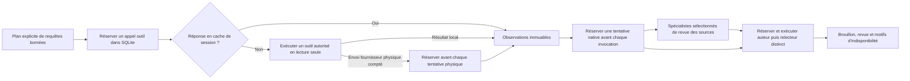

## Vue d’ensemble

Search Console MCP expose une interface MCP sur `stdio`. Le serveur et la CLI partagent le même registre d’outils. Chaque famille de fournisseur conserve son authentification, ses erreurs et ses sémantiques.

## Sélection au démarrage (depuis 1.3.1)

Depuis la version 1.3.1, `tool_selection.py` valide `GSC_MCP_TOOL_FAMILIES` avant d’enregistrer les outils MCP. Sans variable, ou avec `all`, le serveur expose tout le catalogue : 85 outils dans la version publiée 1.3.1, 96 dans la version publiée 1.5.0 et le checkout source. Une liste sélectionne les familles demandées et conserve `core`. Une sélection vide ou inconnue empêche le démarrage. La CLI conserve le catalogue complet. Redémarrez le processus après une modification ; cette sélection ne change ni les identifiants ni les permissions ou confirmations nécessaires. Consultez la [configuration des familles](/fr/docs/installation/).

## Lanceurs source d’audit et d’évaluation non publiés

`audit_runtime.py` fournit une session optionnelle d’acquisition en lecture seule avec des propriétés exactes, un journal SQLite de l’appelant et un cache d’observations immuables propre à la session. Tentatives fournisseur, appels aux outils (y compris au cache) et invocations natives ont des compteurs persistants séparés, liés à une configuration immuable. Les réservations précèdent l’envoi compté et survivent aux échecs/redémarrages ; ce sont des plafonds de tentatives, pas des limites de tokens ou d’argent. L’acquisition auxiliaire HTML/CrUX est hors de cette liste autorisée.

`scripts/run_bounded_audit.py` acquiert un plan explicite, puis peut utiliser `native_audit.py` et les neuf profils de revue des sources de `native_roles.py`. Les spécialistes sélectionnés reçoivent des copies des observations originales sans ajouter de requête d’acquisition ; leurs références conservent les indices source originaux. La concurrence des spécialistes est bornée dans le pipeline ; synthèse et invocation distincte de revue restent séquentielles. La validation structurelle des références ne prouve pas le fondement sémantique. Ces profils n’exécutent ni les playbooks interactifs `.claude/agents/` ni l’ancien hôte JavaScript Workflow.

`native_process.py` lance chaque invocation dans un groupe séparé sous Linux/macOS. Il compte stdout/stderr pendant l’exécution, plafonne chaque flux à 2 000 000 octets, conserve stdout en mémoire bornée et élimine stderr. Un lanceur isolé avant exécution installe `RLIMIT_FSIZE` à cette taille maximale en conservant les limites héritées souples/dures plus faibles. Cela borne chaque fichier ordinaire écrit par le client, notamment son état, et peut le rendre indisponible. Fin, délai et dépassement arrêtent les descendants ordinaires du groupe et attendent l’enfant direct ; les groupes volontairement détachés sont hors de cette garantie. Ce n’est ni un quota disque agrégé, ni une limite mémoire du client, ni un sandbox contre du code hostile.

`scripts/eval_classifier.py`, `scripts/eval_audit_reports.py` et `scripts/eval_content_extraction.py` sont des interfaces hors ligne distinctes, hors du registre public. Les métadonnées des requêtes/paires refusent les identifiants d’auto-revue sans authentifier les humains. L’évaluation de rapports classe des affirmations fournies et laisse l’approbation de publication indisponible. L’extraction compare du HTML local dont le hash est vérifié à des fragments annotés ; précision/rappel du contenu entier et effets sur les avertissements métier restent non mesurés. Un succès synthétique n’approuve aucune de ces tâches ni un backend de modèle payant.

Ces ajouts nécessitent un checkout source ; le wheel publié 1.5.0 ne les fournit pas. Les [cas hors ligne enregistrés des deux clients natifs](https://github.com/FlorianBruniaux/google-search-console-mcp/blob/main/docs/validation/2026-10-10-native-specialists.md) et les [contrôles actuels de sorties/extraction](https://github.com/FlorianBruniaux/google-search-console-mcp/blob/main/docs/validation/2026-10-10-delegated-evaluation-native-limits.md) établissent des périmètres de preuve séparés. Acquisition fournisseur authentifiée, exécution complète des playbooks interactifs et qualité experte humaine restent ouvertes. Consultez le [guide du lanceur natif](/fr/docs/bounded-native-audit/), le [guide d’extraction](/fr/docs/content-extraction/), la [collecte humaine](/fr/docs/expert-evaluation-intake/) et le [plan des actions restantes](https://github.com/FlorianBruniaux/google-search-console-mcp/blob/main/docs/remaining-work-action-plan-2026-10-10.md).

## Sources de données

- Google Search Console : propriétés, performances, inspection d’URL et sitemaps.
- Bing Webmaster Tools : sites, performances, crawl, feeds et backlinks selon l’API disponible.
- GA4, CrUX et PageSpeed : fournisseurs optionnels avec leurs propres autorisations.
- Pages publiques : HTML, robots.txt, sitemaps, métadonnées, schémas et liens internes.
- IndexNow : canal de notification séparé, avec une clé vérifiable par hôte.

## Frontières

Une propriété est toujours un paramètre explicite. Les résultats Google et Bing ne sont pas fusionnés. Les lectures de pages arbitraires passent par les protections réseau du serveur. Les sorties structurées conservent les métadonnées nécessaires à l’interprétation.

## Ajouts de la version 1.3.0

Le registre de la version 1.3.0 compte 85 outils. `ga4_ai_referrals` mesure les visites attribuées à des sources d’assistants documentées, après contrôle de compatibilité et avec des parts conditionnées par la couverture. Les sources candidates restent séparées.

`traffic_health_check` aligne les dates demandées et préserve les états zéro, vide, inconnu et indisponible. Les rapports combinés par page gardent encore leurs fenêtres indépendantes. Les métadonnées décrivent la méthode de chaque verdict ou score concerné sans modifier sa valeur. Cinq audits marquent leur HTML principal non fiable ; le détecteur de challenge protège la validation de schémas et l’audit éditorial.

Consultez les [limites de preuve](/fr/docs/evidence-and-safety/) avant d’interpréter un ratio, un score, un signal d’instruction ou une visite attribuée.

## Correctifs de la version 1.3.1

`traffic_drops` compare deux fenêtres adjacentes de même durée, avec une fin de fenêtre courante trois jours avant aujourd’hui. `seo_lost_queries` conserve sa fenêtre terminant aujourd’hui. Les `diagnosis_candidates`, leur `diagnosis_status` et les métriques précédentes/courantes documentent des règles, sans prouver de cause. Les candidats de classement et CTR exigent des impressions dans les deux périodes ; la baisse de demande exige une diminution observée des impressions. Une requête absente des lignes courantes figure dans `unavailable_queries` avec `metrics_current=null`. Son absence ne prouve pas un trafic nul ; CTR et position restent `null` avec zéro impression.

`seo_cannibalization` conserve son score HHI mais exclut par défaut les requêtes contenant `site:`, `intitle:`, `inurl:` ou `filetype:`. `excluded_search_operator_queries` compte les chaînes distinctes exclues. `include_search_operators=True` les réintègre et conserve ce choix dans les métadonnées. Ces opérateurs peuvent volontairement renvoyer plusieurs pages.

`bing_query_stats` agrège par requête avant le tri et la limite ; `daily=True` restitue les lignes quotidiennes. Les CTR source contradictoires restent indisponibles avec leurs diagnostics, même si la somme masque la contradiction. Le CTR utilise les totaux et les positions disponibles leurs pondérations respectives. Les adaptateurs Bing conservent aussi ces anomalies dans les comparaisons. Voir les [exemples Bing](/fr/docs/bing-setup/).

`ai_visibility_audit` distingue `ClaudeBot` pour l’entraînement, `Claude-User` pour la navigation demandée par l’utilisateur et `Claude-SearchBot` pour la recherche, selon la [documentation des robots Anthropic](https://support.claude.com/en/articles/8896518-does-anthropic-crawl-data-from-the-web-and-how-can-site-owners-block-the-crawler). Une permission robots.txt ne prouve pas une activité de crawl ou une citation IA.

## Outils d’écriture

Une écriture suit cette séquence : lecture de l’état, calcul du périmètre, confirmation explicite, appel du fournisseur, puis vérification de la réponse. L’acceptation d’une demande reste distincte de l’état futur de crawl ou d’indexation.

## Exécution

Le client lance normalement un processus serveur enfant par session active. Évitez de lancer un démon manuel en parallèle. Consultez le [guide d’installation](/fr/docs/installation/) pour mesurer les processus actifs.

[Lire la version anglaise canonique](/docs/architecture/).

## Profil éditorial

`editorial_audit` applique un profil FR/EN versionné aux passages HTML éligibles. Les alertes renvoient leurs extraits, emplacements et limites ; elles ne mesurent ni une probabilité d’écriture IA ni une pénalité de classement. Les instructions demandent de conserver le sens des propositions sans le certifier ; l’outil reste distinct de `content_quality` et n’appelle aucun classificateur. Voir le [profil éditorial](/fr/docs/editorial-audit/).

`search_change_breakdown` compare des fenêtres Google explicites de même durée ; `link_targets_audit` observe les destinations internes publiques dans un budget partagé avec la source. Les [audits à périmètre borné](/fr/docs/audit-workflows/) détaillent leurs paramètres, résultats et limites.

## Suivi et brouillons (depuis 1.4.0)

La version 1.4.0 contient 89 outils : `seo_change_impact`, `rewrite_fidelity_check`, `search_weekday_reference` et `crawl_import_preview` s’ajoutent aux 85 outils de la version publiée 1.3.1. Les versions 1.3.0 et 1.3.1 conservent chacune 85 outils. `change_impact.py` conserve les événements déclarés et réutilise la couverture de `search_change_breakdown`, sans persistance ni attribution causale.

Les fuseaux IANA utilisent la base système ou le secours `tzdata` fourni. `editorial_drafts.py` adapte le texte/Markdown borné au cœur de règles existant, sans récupération réseau, exécution ni lecture de fichier. `rewrite.py` compare littéraux protégés et qualificatifs avec des ancres lexicales locales ; les dimensions sémantiques restent non évaluées.

`reporting.py` ajoute une empreinte déterministe au rapport `search_change_breakdown` sans stocker celui-ci. Le budget facultatif couvre tout le JSON UTF-8, métadonnées comprises ; la CLI préserve le JSON retourné en cas de dépassement ; un plafond trop faible pour l’enveloppe minimale produit une erreur explicite sans JSON. Une seule dimension demandée est valide.

`traffic_reference.py` compare des périodes Google égales et disjointes sur les mêmes jours de semaine, jusqu’à trois jours avant la date Pacifique courante ; elle ne prouve ni effet annuel ni cause. `crawl_import.py` prévisualise en mémoire un JSON SiteOne fourni par l’appelant, avec des bornes fixes, sans crawl, fichier, accès réseau, secret ni jointure GSC. Consultez les [audits bornés](/fr/docs/audit-workflows/) et [workflows éditoriaux](/fr/docs/editorial-workflows/).
